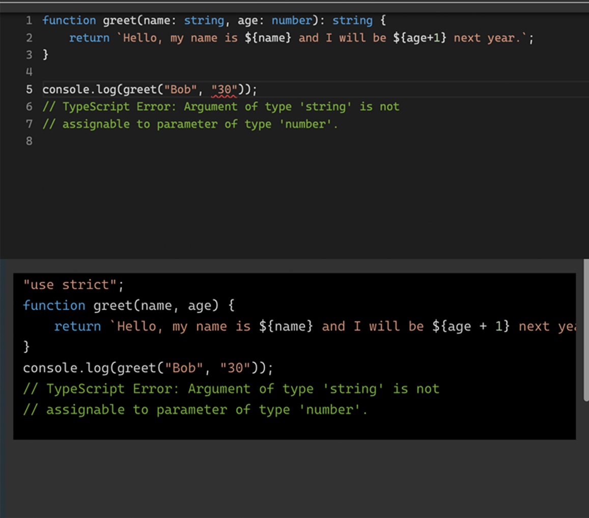

# 为什么选择 TypeScript 和这本书

**本章内容包括**

- 这本书如何帮助你，作为读者的你
- 为什么选择这本书而不是其他资源
- 为什么 TypeScript 是必须学习的 web 开发语言
- TypeScript 工作原理的简要概述

你是否打开这本书时，期待立刻深入 TypeScript 指南以及如何避免 TS 错误？惊喜！你已经踩到了第一个坑——低估了引言的趣味性。你以为我会滔滔不绝地讲述你手中的这本书是关于 TypeScript 及其陷阱的权威指南。这是半对的。另一半呢？嗯，让我这样说吧，我是在喝完第三杯咖啡时写的这段引言，所以请系好安全带，因为我们将开始一段关于这本书如何帮助你、并了解这本书带来的益处的神奇旅程，然后我们再进入 TypeScript 的世界。

探索 TypeScript 的世界既是一个充满挑战的旅程，同时也是一个充满回报的旅程。当你深入 TypeScript 时，你会很快发现它的强大和灵活性。然而，在此过程中，你可能也会遇到一些常见的陷阱，并犯下可能阻碍你进步的错误。这时，这本书就成为了你的可靠伙伴和指南，帮助你避开这些障碍，并充分释放 TypeScript 的潜力。

这里有一个小小的程序员幽默来轻松一下气氛：为什么那个开发者破产了？因为他把所有的缓存都用光了。就像这个笑话一样，TypeScript 也可能让你措手不及。

以下是这本书能为你带来的主要好处：

- **提升对 TypeScript 的理解**：通过研究常见错误，你将对 TypeScript 的内部机制和原理有更深入的了解。这种知识将帮助你编写更简洁、更高效、更易维护的代码。

- **提高代码质量**：从这本书中学习的经验教训将帮助你及早发现代码中的潜在问题，从而提高代码库的质量。这不仅会使你的应用程序更加健壮，还会为你在调试和排查问题上节省时间和精力。

- **提高生产力**：通过避免常见错误，你可以加速开发过程，花更多的时间构建功能和改进应用，而不是修复错误和处理技术债务。

- **加强协作能力**：理解并避免这些错误将使你更容易与其他 TypeScript 开发人员合作。你将能够更有效地沟通，并在项目上与他人合作，共同理解最佳实践和潜在的陷阱。

- **未来-proof你的技能**：随着 TypeScript 的不断发展和流行，掌握这些概念将帮助你在就业市场上保持相关性和需求。

也许你曾尝试掌握 TypeScript，但未能如愿。这不是你的错。即使对我来说，有些 TypeScript 错误也是让人费解的，其背后的原因（或缺乏原因）也很令人困惑。我怀疑 TypeScript 的作者故意让错误信息如此晦涩，以防止太多的外行掌握类型的精髓。

而 TypeScript 是个强大的工具，它的功能是如此庞大！学习 TypeScript 值得花时间读一本或两本书来掌握，然后经过几个月甚至几年的实践来获得它的全部功能和效用。然而，作为软件工程师和 web 开发人员，我们别无选择，必须精通 TypeScript。它已经如此普及，成为所有基于 JavaScript 的代码的事实标准。

总而言之，我们必须学习 TypeScript，因为如果不这样做，很容易退回到老旧的、熟悉的 JavaScript，而这会引发那些熟悉且痛苦的问题，比如类型不匹配、错误的函数参数、错误的对象结构等。说到老旧的 JavaScript 代码，让我们看看为什么我们甚至要费心学习 TypeScript。

## 1.1. 为什么选择 TypeScript？

信不信由你，TypeScript 最近以惊人的速度攀升到了编程语言的受欢迎榜上。事实上，它已成为软件开发领域中使用最广泛的编程语言之一，甚至可能是**最**流行的。这是因为如今大多数软件工程都是基于 web 的，无论是因为需要云端后端，还是因为桌面应用程序只是封装在浏览器中的 web 应用（如 Electron、Chrome PWAs）。照这个趋势发展下去，我不会惊讶地发现人们开始给宠物取名为 TypeScript。你能想象吗？“过来，TypeScript，去取函数！”

作为 JavaScript 的增强版超集，TypeScript 建立在世界上运行时最广泛的语言（如浏览器、Electron 上的桌面应用、React Native 上的移动应用）基础上，通过静态类型、先进的工具以及其他强大的功能，提升了开发者体验和代码质量。难怪它成了每个开发者眼中的苹果，虽然是一个问题更少的苹果！它让开发者既能享用 JavaScript 的蛋糕，还能吃得安心！但究竟是什么让 TypeScript 对开发者和企业都如此具有吸引力？是它的魅力？它的惊人外观？还是它那无法抗拒的吸引力？让我们探讨一下 TypeScript 日益流行背后的关键原因。

- **静态类型**：TypeScript 引入了静态类型检查功能，这有助于在开发过程中早期捕捉错误。通过提供类型信息，TypeScript 使开发者能够在潜在问题变成运行时错误之前发现它们。这不仅提高了代码的可靠性和可维护性，还最终降低了调试和排查问题的成本与精力。

- **改进的开发者体验**：TypeScript 的静态类型检查还使编辑器和 IDE 能够提供更好的自动完成、类型检查和重构功能。这些工具和编辑器支持提升了开发体验，使代码的编写、导航和维护更加轻松。因此，开发者可以更高效地工作。

- **代码库可扩展性**：TypeScript 旨在帮助有效地管理和扩展大型代码库。它使用类型推断来提供出色的工具支持。其类型系统、检查机制、模块化架构和高级功能使得组织和维护复杂应用变得更容易，使得 TypeScript 成为小型项目和企业级应用的理想选择。换句话说，无论项目规模如何，TypeScript 都能为开发者提供更好的工具支持。

- **强大的社区和生态系统**：TypeScript 拥有一个充满活力且不断增长的社区，社区成员持续为其发展做出贡献，并通过各种渠道提供支持。该语言得到了微软的支持，确保了定期更新、改进和长期稳定性。此外，TypeScript 与 JavaScript 的兼容性意味着开发者可以利用现有的库和框架，简化了采用过程并降低了学习曲线（见下文逐步采用一节）。

- **面向未来**：TypeScript 通常会引入即将推出的 JavaScript 功能，使开发者能够在保持与旧版浏览器和环境兼容的同时，使用最新的语言增强功能。这使得 TypeScript 项目始终处于技术前沿，并确保开发者为 JavaScript 语言的未来演变做好准备。

- **逐步采用**：TypeScript 的一个重要优点是它可以逐步采用。开发者可以在现有的 JavaScript 项目中逐步引入 TypeScript，而无需重写整个代码库。这使得拥有现有 JavaScript 代码的团队能够以自己的节奏逐渐过渡到 TypeScript，并逐步享受其带来的好处，或者保留旧的 JavaScript 代码，并在新的开发中开始使用 TypeScript。TypeScript 可以在任何 JavaScript 运行的地方运行：Node.js、Deno、Electron、Tauri、React Native。

- **代码共享**：由于 TypeScript 有类型，使用 TypeScript 编写的模块在其他模块、程序和应用中使用时更安全、可靠且更少出错。质量提高，成本和时间减少。开发者体验也大大改善，因为有自动补全和早期错误捕获功能。无论是作为开源项目外部共享，还是在公司内部共享，TypeScript 都是代码共享和代码重用的绝佳选择。

- **提升就业能力、职业前景和薪资**：随着 TypeScript 成为 web 开发（软件开发中占比很大甚至是最大的部分）的事实标准，不精通它可能对你的职业生涯产生不利影响。此外，调查数据显示，TypeScript 开发者通常比 JavaScript 开发者拿到的薪水更高。

总之，TypeScript 是一种强大且灵活的编程语言（也是一种开发工具），它结合了 JavaScript 的流行与优势，并添加了减少错误、提高代码质量、提升开发者体验、开发效率和项目可扩展性的额外功能。通过选择 TypeScript，开发者可以编写更健壮、可维护且面向未来的应用程序，使其成为现代软件开发项目的绝佳选择。接下来，让我们看看 TypeScript 实际上是如何工作的。

## 1.2. TypeScript 是如何工作的？

我给你讲个笑话：JavaScript 被抢劫后为什么没有报警？因为 TypeScript 说它是一个*超集*，不是嫌疑犯！TypeScript 是 JavaScript 的静态类型超集，它编译成纯 JavaScript。换句话说，TypeScript 通过添加可选的静态类型和其他功能扩展了 JavaScript 语言，例如接口、泛型、枚举、可选链等。这些 TypeScript 的增强功能并不仅仅是为了炫耀，而是为了让编写和维护大规模应用程序（在正式场合称为“企业应用”）变得更加容易。TypeScript 提供了更好的工具、更严格的错误检查以及更优秀的代码组织。

以下是 TypeScript 工作原理的高级思维模型：

- **代码编写**：开发人员编写 TypeScript 代码。TypeScript 代码写在以 .ts 扩展名结尾的文件中。你可以使用所有的 JavaScript 功能以及 TypeScript 特有的功能，例如类型、接口、类、装饰器等等。根据编辑器、项目配置和构建工具的不同，开发人员会看到提示、早期警告和错误（来自静态类型检查）。

- **类型检查**：TypeScript 帮助在开发过程中捕获错误。你可以为变量、函数参数和返回值添加可选的类型注释。TypeScript 的类型检查器会分析你的代码，并在代码编译之前报告任何类型不匹配或潜在问题。类型检查通常由编辑器（IDE）或处于监视模式的编译工具即时完成。

- **构建编译**：TypeScript 代码必须编译（或“转换”）为纯 JavaScript，才能在浏览器或其他 JavaScript 环境中执行。TypeScript 编译器（tsc）负责这个过程。它将你的 TypeScript 源文件转换为可以在任何兼容环境中运行的 JavaScript 文件。值得一提的是，大部分的编译过程都是去除像类型这样的额外代码，但也有一些例外，例如使 async 函数在 ES5 中正常工作。

- **打包**：此时，JS 代码会与其他 JS/TS 依赖项，甚至是 CSS 和图片一起打包，以准备进行开发、测试或生产部署。根据环境的不同，打包会使用不同的配置完成。这是 Webpack、Babel、Rollup、Gulp、ESBuild 等工具发挥作用的地方。

- **执行**：一旦你的 TypeScript 代码被编译成 JavaScript，它就可以像任何其他 JavaScript 代码一样执行。你可以将生成的 JavaScript 文件包含在 HTML 文件中、无服务器函数中，或在 Node.js 环境中运行它们。

在我们所描述的 TypeScript 工作原理的这五个高级步骤中，TypeScript 在几乎所有流行的现代代码编辑器（IDE）中都提供了出色的工具支持，如 Visual Studio Code (VS Code)、Eclipse、Vim、Sublime Text 和 WebStorm。这些工具就像白雪公主的魔镜——随时准备提供类型错误的实时反馈、自动完成功能以及代码导航功能，使你的开发更快、更高效。再给你讲个笑话：为什么开发人员从不和他们的 IDE 玩捉迷藏？因为你不可能躲藏起来，它们总会指出你的错误！

请看下面的例子，我们故意设置了一个类型不匹配。函数参数 `age` 需要是一个数字，但在函数调用时传入了一个字符串 "30"。函数的结果是 "301" 而不是 "31"。然而，TypeScript 在代码运行之前帮助我们捕获了这个错误，通过显示红线和错误信息“字符串类型的参数不可分配给数字类型的参数”来提醒我们。

图 1.1 TypeScript Playground 在编辑器中显示错误，帮助在不运行代码的情况下捕获错误

总之，TypeScript 通过扩展 JavaScript 语言，添加可选的静态类型和其他功能，提供更好的工具和错误检查。其过程很简单：你编写 TypeScript 代码，然后代码通过类型检查（如果编写得当，会非常稳健，否则就会有很多 `any` 和 `unknown`）。接着，代码会被编译成可以在任何 JavaScript 环境中执行的纯 JavaScript。就像变色龙一样，TypeScript 会在任何 JavaScript 能运行的地方发挥其作用。

不过，TypeScript 并不总是阳光灿烂、没有错误的彩虹和芳香的玫瑰。它也有一些怪异、经常被误解的和难以捉摸的方面。这也是本书问世的原因。现在，让我们深入探讨一下本书是如何构建的，以在你的 TypeScript 旅程中提供帮助。

## 1.3. 本书的结构
为了方便读者学习并增加趣味性，本书将 100 个最常见且最关键的 TypeScript 错误分为以下几大类：

- 基本错误

- 与类型、类型别名和接口相关的错误

- 与函数和方法相关的错误

- 与类和构造函数相关的错误

- 高级部分和糟糕部分

不同章节的分类基于错误的性质和影响。每个错误都会得到详细的解释，使你能够理解其潜在问题，并学习如何在项目中避免这些错误。我们将提供如莎士比亚十四行诗般优雅的示例（但有更多的代码和更少的五步抑扬格），随后是实用的解决方案和最佳实践，你可以轻松地将其集成到你的代码库中。

附录部分会介绍 TypeScript 的设置方法（用于代码示例）、TypeScript 备忘单以及额外的 TypeScript 资源和延伸阅读。现在我们知道了应该期待什么，但你可能会问，如何最有效地使用这本书呢？

## 1.4. 如何使用本书

建议从头到尾阅读或至少浏览本书，从第二章“基础”开始。每一章都有一个“本章内容”和总结要点，非常适合快速浏览内容。即使是我的出版商，也只是看了这些要点，而不是整本书，这可是我听说的。

至于代码，大多数代码可以在 playground 或者你电脑上的文件中运行。现在有很多免费的 TypeScript playground/沙箱浏览器环境。我使用了官方 TypeScript 网站上的那个，位于：[typescriptlang.org/play](https://www.typescriptlang.org/play)。如果你想在电脑上运行代码，我在附录 A：TypeScript 设置中写了最简单的 TypeScript 设置和安装的详细步骤。

我建议在安静的环境中，以舒适的姿势（沙发、扶手椅）和一杯咖啡阅读纸质书籍。这种方式可以轻松浏览本书，理解其中的思想。在飞机、火车、地铁或咖啡馆里由于噪音和干扰，很难阅读这本书，但也不是不可能。或者，我建议在电脑上阅读电子书，同时打开代码编辑器或 playground，随时准备复制粘贴代码并运行。这样你能更深入地理解主题，并能实际操作代码。通过代码实验，可以让示例变得生动，阅读也更加互动和有趣。这种代码实验可以让你在脑海中点亮“啊哈！”的灯泡。

最后，请不要因为拼写错误、遗漏和错误而感到沮丧。希望不会有太多这样的情况发生，因为 Manning 有一个出色的团队！然而，我写了 20 本书，深知拼写错误和错误是不可避免的，无论有多少编辑和审稿人（读者）看过它们。只需向 Manning 提交勘误表，以便未来版本改进。我们会非常感谢你的贡献。

## 1.5. 本书的目标读者

值得注意的是，这本 *50 TypeScript Mistakes* 是为 TypeScript 的初学者和进阶初学者而写。我在写这本书时设想的读者是对 TypeScript 和 JavaScript 都不太熟悉的专业软件工程师。很多 TypeScript 的内容都根植于 JavaScript，因此有时需要了解 JavaScript 的工作原理才能理解 TypeScript。我是为那些对 JavaScript 还不熟悉且没有二十年经验的人写的。你可以自行判断我是否成功。我的编辑总是评论说我需要解释更多，我也做了。但与此同时，这本书只有必要的信息，没有多余的内容。

这本书同样适合那些已经使用 TypeScript 并且可以顺利进行编码，但没有时间或机会深入理解的人。对于那些已经浅尝辄止的 TypeScript 爱好者来说，这本书非常适合！也许他们已经使用过 TypeScript，并且能够在其中游刃有余，但还没有机会深入挖掘。这本书对他们来说是一个很好的选择！

另一方面，如果你是 TypeScript 的大师，能够像唱你最喜欢的歌一样背诵 TypeScript 的文档和源代码，那么这本书可能不是你的菜。无意冒犯，我并不是为那些已经在 TypeScript 世界巡回演出的“摇滚明星”写的这本书。为什么呢？因为我想让这本书像单口喜剧演员的笑话一样简洁。说到喜剧：为什么 TypeScript 开发者在开车时被罚了款？因为他们没有遵守“类型”限制！

这本书不应被视为 TypeScript 文档的替代品。文档设计得很全面，篇幅长，而且让我们面对现实吧，读它就像看油漆干一样无聊。很少有人喜欢阅读技术文档，而我不是其中之一。我宁愿看一个无限循环的程序在运行。除非你手头有一本这样的书，否则你只能依赖那些令人昏昏欲睡的文档。最后再给你讲个笑话：为什么开发者从来不读完整的 TypeScript 文档？因为这不是他们喜欢的“类型”小说！

技术文档虽然必要，但很少让人兴奋。这就是这本书的存在意义，承诺比文档更简短、更专注，并且更加有趣。我们精心设计了小而易消化的示例——可以将其视为美味的编码小吃，完美地帮助你理解而不会感到消化不良。

## 1.6. 为什么这本书会对你有帮助

为了鼓励读者，我本想以“犯错是人之常情，通过你的 TypeScript 代码库修复错误，是神圣的”这样一句深奥的话开头。但你可能并不是为了我的哲学思考或半吊子的幽默买这本书的。你是来学习的，或者更准确地说，是来重新学习——那些你已经在 TypeScript 中犯下却没有意识到的错误。别担心，我们都经历过。这不是你的错！我们中的一些人还在那个迷宫中迷失，不知所措。

记住，错误不是失败；它只是证明你在尝试。而且如果你在尝试，那你就正在进步。对于那些曾在凌晨对着显示器大喊“为什么，TypeScript，为什么？”的人，我想告诉你：我也经历过。TypeScript 经常会有那些让人摸不着头脑的错误信息，这不是你的错。在我多年的科技行业生涯中，从小型初创公司到科技巨头，我有幸（或者说不幸？）犯下了无数 JavaScript 和 TypeScript 错误，而这些错误的规模，坦白说，令人恐惧。我曾直面无类型变量的深渊，与不兼容类型的大军作斗争，并被神秘的“any”所误导。我的情感调试器上还有伤疤为证。但别担心，我不是来提醒你噩梦的，我是来告诉你，在 TypeScript 的沙漠中有一个绿洲，我们一起去寻找它。

把这本书当作你的 TypeScript 最佳朋友——一个会告诉你如果你牙齿上沾了菠菜（读作：代码中有明显的 bug）的好朋友，而且还会和你一起笑，而不是让你一天都那样。你即将踏上 TypeScript 的雷区之旅。这是一个百步之行，每一步都有一个我曾经掉入的陷阱，这样你就不必再踩进去。

这本书与其他书籍的不同之处在于，它提供了简短实用的技巧和知识点，而且是最近更新的，涵盖了最新的 TypeScript 特性，而大多数其他 TypeScript 书籍已经有几年历史了。这本书在未来几年内仍然具有很高的实用性，因为 a) 书中的内容主要集中在不太可能改变的基础知识 b) TypeScript 本身已经成为一种广泛采用、成熟、经过验证的技术，即使在新的主要版本中也不太可能发生重大变化。

此外，这本书没有广告、新闻或搞笑猫视频（相较于 YouTube 或免费博客文章）。这本书 *几乎* 没有拼写错误，并且语法得当，这要归功于 Manning Publications 的出色编辑团队。此外，这本书还很有趣（至少它努力做到了）。因此，如果你梦想着精通 TypeScript，能够更快地构建出高质量的产品功能，以至于晚上能安然入睡，不被烦人的轮值呼叫打扰，那么这是适合你的资源。这本书将为你提供必要的心灵安宁和专业知识，让你不仅可以吃蛋糕，还可以享用蛋糕。毕竟，如果你不能吃蛋糕，拥有蛋糕又有什么意义呢！

记住，你不必一开始就很厉害，但要成为高手，你必须开始。唯一的出路就是坚持下去，如果有一件事我能保证，那就是：你一定会成功到达彼岸。因为关于错误有这样一件事：每个人都会犯错，但真正的愚者是不从中学习的人（双关语：愚者与流行的测试框架无关）。

最后请记住，不管你多么讨厌 TypeScript，TypeScript 依然爱着你 ❤️！

顺便说一下，TypeScript 如何表达它的爱意？“我们之间的关系有很多潜力... 一旦它被正确定义并严格类型化。”

## 1.7. 总结

- TypeScript 是一种流行且强大的语言，提供了诸多优势，如静态类型检查、代码库可扩展性、改进的开发者体验、渐进式采用、未来的技术保障、强大的社区和生态系统，以及提高的就业机会、职位前景和薪资。

- TypeScript 是 JavaScript 的超集，这意味着 TypeScript 可以做 JavaScript 能做的一切，而且还可以做更多。其主要优势之一是在编译时而非运行时捕捉与类型相关的错误。

- 本书旨在成为进阶初学者级别 TypeScript 开发者的快速、有趣且易于访问的资源。

- 通过

识别、分析和纠正 100 个最常见且关键的 TypeScript 错误，你将能够自信且技能娴熟地应对任何 TypeScript 项目。

- 本书的作者 Azat MARDAN 拥有丰富的 TypeScript 经验，写了畅销书（《Practical Node.js》、《Pro Express》、《React Quickly》），并曾在科技巨头（谷歌、Capital One）、中型科技公司（DocuSign、Indeed）和小型初创公司（两次退出）工作。

- TypeScript 很难学，但这不是你的错。一旦你掌握了它，你将获得巨大的力量。