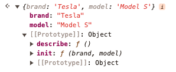
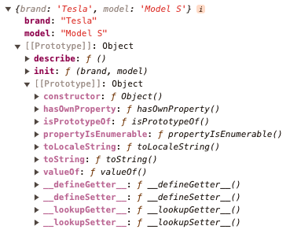

# 5。类和构造函数

**本章涵盖**

- 实现接口和抽象类

- 管理静态成员和访问修饰符

- 初始化类属性

- 组织类 getter 和 setter

- 确保安全覆盖

- 在类中使用装饰器

从历史上看，JavaScript 被设计为一种具有一些面向对象编程 (OOP) 功能的函数式语言。在某种程度上，JavaScript 试图同时成为一种函数式语言和一种 OOP 语言。例如，Array.map() 和 Array.reduce() 是非常实用的方法，而 const tesla = Object.create(Car) 是 OOP。几年前，类语法被添加到 JavaScript 中（又名语法糖）。在此介绍之前，软件工程师必须编写原型或函数工厂继承。然而，类只是一种语法，无论好坏，它的底层仍然遵循基于原型的旧模型。关于类，我问你一个问题：为什么 JavaScript 文件变成了 TypeScript 文件？因为它想要接触它的“内部阶级”！ :-)

在当今时代，大多数开发人员只是使用类而懒得去理解它。但我知道你是一个比较彻底的人，因为你买了这本书。事实上，掌握 JavaScript/TypeScript 的原型性质对于避免许多讨厌的错误（对于类也是如此）至关重要。理解 JavaScript 的原型继承就像试图解开已经放在口袋里一周的耳机一样。正当你以为自己已经弄清楚了规律的时候，你却发现了另一个结！因此，让我们回顾一下这些概念，以真正理解具体细节。

首先，请考虑这个示例，它使用原型继承在 JavaScript/TypeScript 中实现类似 OOP 的继承，其中我们定义了一个对象原型 Car，就像任何其他对象一样。它有两个方法init和describe。

```typescript
const Car = {
  init: function (brand, model) {
    this.brand = brand;
    this.model = model;
  },

  describe: function () {
    return `${this.brand} ${this.model}`;
  },
};
```

我们刚刚定义的 Car 对象可以像类一样使用（尽管有注意事项）。因此，我们可以基于 Car 对象（被调用并充当原型）创建一个新对象（实例）tesla：

```typescript
let tesla = Object.create(Car);
tesla.init("Tesla", "Model S");

console.log(tesla.describe()); // Output: Tesla Model S
```

在上面的代码中，Car充当对象原型。这类似于其他 OOP 语言中的类：tesla 可以调用方法 init 和describe。在某种程度上，通过使用 Object.create(Car)，我们生成了一个新对象，它是 Car 的“实例”。尽管如此，这并不是一个真正的班级。如果我们仔细检查 tesla，brand 和 model 将是该对象的属性（property），但描述和 init 将是其原型的属性：

{alt: "自动生成的计算机代码描述的屏幕截图", width: "60%"}


Car 对象本身有一个像任何 JavaScript/TypeScript 对象一样的原型。这就是我们如何获得像 toString() 这样的函数。

{alt:“在此处插入图像的描述”，宽度：“80%”}


您可能想知道为什么方法是在原型上还是在实例上很重要？这很重要，因为当原型方法发生变化时，或者如果原型方法发生变化，它会在所有实例上自动更改。例如，更改 Car 上的描述将自动更改 tesla 上的描述，从而导致输出“Toyota Corolla”，而不是之前的“Tesla Model S”：

```typescript
Car.describe = () => `Toyota Corolla`;
console.log(tesla.describe()); // Output: 'Toyota Corolla'
```

根据您询问的对象，这种与“类”的原型“链接”可能是一个功能，也可能是一个错误。对我来说，这更像是一个错误，因为它多次从后面夹住我！

在 ES6 中，JavaScript 采用了类语法作为基于原型的系统的语法糖，为来自基于类的 OOP 语言的程序员提供了更熟悉的语法。以下是如何使用 ES6 类重写上面的示例。首先，我们定义一个 Car 类，它有一个构造函数和一个名为describe 的方法：

```typescript
class Car {
  constructor(brand, model) {
    this.brand = brand;
    this.model = model;
  }

  describe() {
    return `${this.brand} ${this.model}`;
  }
}
```

现在我们可以创建 Car 类的新实例。使用 new Car("Tesla", "Model S") 创建一个新的 Car 实例，并且该实例可以访问类定义中的描述方法。因此，我们创建了另一个实例 alfaRomeo。

```typescript
let tesla = new Car("Tesla", "Model S");
console.log(tesla.describe());            // #A

let alfaRomeo = new Car("Alfa Romeo", "Giulietta");
console.log(alfaRomeo.describe());        // #B
```

`#A Output: Tesla Model S`
`#B Alfa Romeo Giulietta`

因此，更改类的描述将导致所有实例中出现新的行为（不同的输出）：

```typescript
Car.prototype.describe = function() {     // #A
  return `${this.model} - ${this.brand}`
}

tesla.describe()                          // #B
alfaRomeo.describe()                      // #C
```

`#A Class puts the properties in the prototype of Car unlike the previous example with object-based prototypes`
代码_9_占位符
`#C Giulietta - Alfa Romeo`

顺便说一句，“类”（或原型对象）的命名完全是常规含义，您不必将其大写（例如，Car），但这就是（大多数）接受的风格。另一方面，“类”（或原型）的实例，例如 tesla，通常都是小写，因为它们不太重要，也许吧？请原谅，但我在写关于类的文章时无法抗拒这个笑话：为什么 TypeScript 程序员被赶出了学校？因为他拒绝加入任何没有定义构造函数的类！

因此，TypeScript 的出现确实通过将静态类型和接口引入到 JavaScript 语言中而彻底改变了 JavaScript。 ES6 使类成为主流，而不是纯粹的原型继承（但我自己仍然喜欢函数工厂）。作为一名开发人员，如果您来自 C# 或 Java 等面向对象的编程语言，您会发现 TypeScript 的类语法非常熟悉。但仅仅因为某些东西看起来很熟悉并不意味着它的运作方式相同。对于 TypeScript 类和构造函数来说确实如此，这是一个被误解的概念，具有一些特性，可能会导致代价高昂的错误。人们可能会认为 TypeScript 作为 JavaScript 的超集，会遵守 JavaScript for Classes 的规则和限制。这通常是正确的，但 TypeScript 引入了额外的功能和检查，可能会让开发人员措手不及。即使对于经验丰富的开发人员来说，这些差异也可能会导致混乱并导致错误。

## 5.1.了解何时实现类的接口

接口是 TypeScript 的核心功能，允许您定义对象和函数的契约。定义接口时，您正在指定对象或函数必须具有的一组属性或方法，以便被视为与该接口“兼容”。然而，在 TypeScript 中，我们并不总是需要为每个类定义单独的接口。让我们从一个简单的示例开始，该示例具有一个具有三个属性的 User 类和一个构造函数，该构造函数在初始化时将这些属性值分配给传递给构造函数方法：

```typescript
class User {
  id: string;
  email: string;
  password: string;

  constructor(id: string, email: string, password: string) {
    this.id = id;
    this.email = email;
    this.password = password;
  }
}

const newUser = new User("1", "Dima Ivanov", "123");
```

newUser 对象具有 User 类型。在某种程度上，TypeScript 会根据类定义自动创建 User 类型，然后在看到赋值运算符 const newUser = new User() 时将 User 类型分配给 newUser。当我错误地尝试使用 newUser.isAdmin = true; 添加新属性时，我会收到 TS 问题“属性‘isAdmin’在类型‘User’上不存在。”

这段代码对于很多用例来说都很好，但是如何确保类本身遵循某种形状呢？因此，该示例缺少一个重要的部分——接口。如果没有接口，我们就会失去 TypeScript 强制类本身形状的能力。例如，如果我们为任何用户都有一个通用接口，那么我们可以创建实现基本接口的类，同时添加附加功能。这样我们就可以放心，公共部分都已实现，并且任何人都不会意外地错过所需的属性。通过使用接口，我们获得了额外的安全层，确保我们的类遵守特定的契约。

以下是我们如何通过添加用于 User 的接口 IUser 来改进之前的代码。是的，在我写之前，在 TypeScript 编码风格中，带有 I 前缀是一种不好的语气，但在这里，了解 User 类之间的差异很有帮助。

```typescript
interface IUser {                 // #A
  id: string;
  email: string;
  password: string;
}

class Editor implements IUser {   // #B

  id: string;
  email: string;
  password: string;
  editRights: string[] = [];     // #C

  constructor(id: string, email: string, password: string) {
    this.id = id;
    this.email = email;
    this.password = password;
  }
}

class Viewer implements IUser {  // #D

  id: string;
  email: string;
  password: string;
  viewRights: string[] = [];     // #E

  constructor(id: string, email: string, password: string) {
    this.id = id;
    this.email = email;
    this.password = password;
  }
}

const viewer = new Viewer("1", "Rohan Gupta", "123456");
const editor = new Editor("2", "Priya Chatterjee", "p@ssword1");
```

`#A Define the interface with common required properties`
`#B Implement the interface for the Editor class`
`#C Property unique to Editor`
`#D Implement the interface for the Viewer class`
`#E Property unique to Viewer`

现在，我们有一个 IUser 接口，并且我们的 Editor 和 Viewer 类实现了该接口。这意味着如果我们未能从类中的接口实现任何方法或属性，TypeScript 就会向我们发出错误警报。同样，如果其中一种方法具有不同的签名或参数，我们将收到错误。相反，如果我们要向类中添加接口中未定义的新方法或属性，TypeScript 也可以接受。

```typescript
interface IUser {
  id: string;
  email: string;
  password: string;

  getPermissions(): string[];
}

class PasswordLessUser implements IUser {  // #A
  id: string;
  email: string;
  phone: string = "";                     // #B

  getPermissions() {
    return "organizations:view";          // #C
  }

  constructor(id: string, email: string) {
    this.id = id;
    this.email = email;
  }
}
```

`#A Class 'User' incorrectly implements interface 'IUser'. Property 'password' is missing in type 'PasswordLessUser' but required in type 'IUser'.`
`#B Property 'getPermissions' in type 'PasswordLessUser' is not assignable to the same property in base type 'IUser', because the return type needs to be an array of strings, not a single string.`

有趣的是，我们还可以使用接口（IUser）作为对象的类型而不是 User 类：

```typescript
const newUser: IUser = new User("1", "Dima Ivanov", "123");
```

在这种情况下，虽然该类可以具有接口 IUser 中没有的附加属性（例如电话），但如果我们在 newUser 上将类型指定为 IUser，则属性必须严格匹配。因此，在下面的代码中，我们将收到错误“‘IUser’类型上不存在属性‘phone’”：

```typescript
const newUser: IUser = new User("Dima Ivanov", 30);
console.log(newUser.phone);
```

您是否注意到在查看器和编辑器中我们最终重复了大量代码？为什么不使用基类来使代码更具有说服力并提高可读性和可维护性呢？

```typescript
interface IUser {
  id: string;
  email: string;
  password: string;
}

class User implements IUser {            // #A
  id: string;
  email: string;
  password: string;

  constructor(id: string, email: string, password: string) {
    this.id = id;
    this.email = email;
    this.password = password;
  }
}

class Viewer extends User {
  viewRights: string[] = [];

  addViewRight(right: string): void {    // #B
    this.viewRights.push(right);
    console.log(`View right added: ${right}`);
  }
}

class Editor extends User {
  editRights: string[] = [];

  addEditRight(right: string): void {    // #C

    this.editRights.push(right);
    console.log(`Edit right added: ${right}`);
  }
}

const viewer = new Viewer("1", "Rohan Gupta", "123456");
const editor = new Editor("2", "Priya Chatterjee", "p@ssword1");

viewer.addViewRight("Read Articles");    // #D
editor.addEditRight("Modify Articles");

console.log(viewer);
console.log(editor);
```

`#A Base class`
`#B Method to add a view right`
`#C Method to add an edit right`
`#D Example method calls`

最后但并非最不重要的一点是，接口很酷，因为它们允许一个类符合（“实现”）多个接口，而通过类继承（“扩展”）我们只能从一个类继承。例如，我们可以增强我们的示例，使其具有一个 Contributor 类，它当然需要具有普通用户、查看器和编辑器的所有属性（如果不查看就很难进行编辑）：

```typescript
interface IUser {
  id: string;
  email: string;
  password: string;
}

interface IViewer {
  viewRights: string[];
  addViewRight(right: string): void;
}

interface IEditor {
  editRights: string[];
  addEditRight(right: string): void;
}

class Contributor implements IUser, IViewer, IEditor {  // #A

  id: string;
  email: string;
  password: string;
  viewRights: string[];
  editRights: string[];

  constructor(id: string, email: string, password: string) {
    this.id = id;
    this.email = email;
    this.password = password;
    this.viewRights = [];
    this.editRights = [];
  }

  addViewRight(right: string): void {
    this.viewRights.push(right);
    console.log(`View right added: ${right}`);
  }

  addEditRight(right: string): void {
    this.editRights.push(right);
    console.log(`Edit right added: ${right}`);
  }
}

const contributor = new Contributor(            // #B
  "3",
  "ananya.krishnan@example.com",
  "secure123"
);  

contributor.addViewRight("View Dashboard");
contributor.addEditRight("Edit Dashboard");

console.log(`Contributor ID: ${contributor.id}`); // #C
console.log(`Contributor Email: ${contributor.email}`);
console.log(`Contributor View Rights: ${contributor.viewRights.join(", ")}`);
console.log(`Contributor Edit Rights: ${contributor.editRights.join(", ")}`);
```

`#A Class that implements IUser, IViewer, and IEditor`
`#B Example usage of Contributor`
`#C Output the contributor's details and rights`

请记住，接口是在代码中强制执行某些约定的有效方法，将它们与类一起使用是增强代码可读性和可维护性的良好实践。忽略接口可能会导致意外行为、编译时遗漏错误以及普遍丧失 TypeScript 提供的优势。

考虑到这一点，您可能想知道何时使用界面以及何时跳过它们？公平的问题。我建议在以下场景中使用接口：

- 定义类的契约：TypeScript 中的接口通常用于定义类必须遵循的契约，指定类必须实现哪些方法和属性。这对于确保一致性非常有用，尤其是在与复杂系统或大型团队合作时。因此，每当您拥有多于一段代码（库、应用程序、服务）并试图相互通信时，最好考虑通过强制执行契约来在它们之间建立共同点。

- 确保相似类之间的一致性：如果您有多个应共享相同结构的类，则使用接口可以强制它们都实现相同的属性和方法。这在不同类代表不同策略或类型但应具有相同基本功能的场景中非常有用。

- 解耦代码：接口有助于将类的实际实现与其所遵循的接口解耦，尤其是在多个项目/库/应用程序之间作为单独的包/模块共享的接口。这允许您更改类的实现，而不会影响使用该类的任何代码，只要接口保持不变即可。它在依赖项注入和使用测试驱动开发 (TDD) 开发软件时特别有用。

- 增强代码可读性和可维护性：通过使用接口，可以使代码更加结构化且更易于理解。其他人可以快速查看预期的输入和输出是什么，以及特定类型的对象可以使用哪些方法，而无需查看完整的实现细节。

- 促进代码重用和重构：通过接口，您可以设计更通用和可重用的代码组件，因为组件依赖于接口，而不是具体的实现。这使得重构代码变得更加容易，因为实现中的更改不会影响接口合规性。

- 使用库或框架：许多 JavaScript 库和 TypeScript 框架需要或受益于使用接口与其系统集成。接口可用于将自定义类与这些库/框架更无缝地集成。

- 多态性：接口允许 TypeScript 类实现多个接口，而类只能从一个基类继承，从而提供了一种模拟多重继承并增加代码灵活性的方法。

本节介绍了围绕类接口的使用的多个用例。当您冒险进入 TypeScript 世界时，请记住何时使用对您有利的接口的准则，以使您的代码更安全、更可靠且更易于理解。相反，不要担心跳过 TypeScript 代码中的接口（当然，只要这样做不会导致意外的错误和错误。）

## 5.2.滥用抽象类

在 TypeScript 中，抽象类是提供“蓝图”或契约的一种方式。抽象类通常用于为一组相关类提供公共实现，或在其子类中强制执行某种结构或行为。它们可能不会直接实例化，但可以为子类提供功能（实现的方法）和行为轮廓（抽象方法）。在某种程度上，抽象类与接口非常相似，因此值得花一些时间来理解它们之间的关键区别。以下是主要差异的细分：

TypeScript 中的抽象类用于概述可由多个子类共享的公共结构和行为。它们可以包括可由子类继承的实现细节（即方法实现）。抽象类是不能直接实例化的类。相反，它必须由其他类扩展。抽象类可以有抽象方法（没有实现细节）和常规方法（有实现细节）。

- 包含实现：抽象类可以提供完整的方法实现，子类可以继承或重写。它们还可以包含成员变量。

- 支持构造函数：抽象类可以有构造函数，允许对新实例的初始化进行更详细的控制。

- 仅限于单继承：由于 TypeScript（和 JavaScript）不支持多类继承，因此一个类只能扩展一个抽象类。

由 Dog 类使用的抽象类 Animal 的示例，而 Dog 类又由实例 Chewbarka（狗的名称）使用：

```typescript
abstract class Animal {
  abstract makeSound(): void; // #A

  move(): void {
    console.log("Moving along!");
  }
}

class Dog extends Animal {
  makeSound(): void {
    console.log("Bark");
  }
}

const Chewbarka = new Dog();

Chewbarka.move();            // #B
Chewbarka.makeSound();       // #C
```

`#A Must be implemented by subclasses`
`#B Moving along!`
`#C Bark`

另一方面，TypeScript 中的接口纯粹是定义对象形状的结构契约。接口本身不包含实现细节，但定义类必须实现的属性和方法。

- 没有实现：接口严格定义要做什么，而不是如何完成。它们不能包含任何实际的可执行代码。

- 无构造函数：接口不能有构造函数，因此不能规定有关对象初始化的任何细节。

- 支持多重继承：接口支持多重继承，允许一个类实现多个接口，这对于从多个源定义功能非常有用。

Dog 类使用的接口 Movable 和 SoundCapable 的示例，而 Dog 类又由实例 Pup Tart （狗的名称）使用：

```typescript
interface Movable {
  move(): void;
}

interface SoundCapable {
  makeSound(): void;
}

class Dog implements Movable, SoundCapable {  // #A

  move(): void {
    console.log("Dog runs swiftly.");
  }

  makeSound(): void {
    console.log("Woof");
  }
}

const PupTart = new Dog();
PupTart.move();      // #B
PupTart.makeSound(); // #C
```

`#A Implementing the SoundCapable interface`
`#B Dog runs swiftly`
`#C Woof`

Dog 类扩展 Animal 并实现 Movable 和 SoundCapable 接口。 Dog 类提供 move 和 makeSound 方法的实现。

总而言之，在 TypeScript 中，抽象类和接口都用于在代码中定义契约，但它们具有不同的用途并具有不同的功能。误解或误用抽象类可能会导致代码不必要的复杂性和混乱。

使用抽象类时犯的小错误之一是尝试实例化抽象类。这是次要的，因为我们收到了 TypeScript 警告。也就是说，此代码的最后一行将抛出“错误：无法创建抽象类的实例”：

```typescript
abstract class AbstractVehicle {
  abstract makeNoise(): void;

  start() {
    console.log("The vehicle starts.");
  }
}

let myVehicle = new AbstractVehicle();
```

在上面的代码中，当我们尝试实例化抽象类时，TypeScript 将报告错误。抽象类旨在由其他类扩展，而不是直接实例化。要修复该错误，我们需要定义一个 Car 类并实例化该类而不是 AbstractVehicle：

```typescript
abstract class AbstractVehicle {
  abstract makeNoise(): void;
  start() {
    console.log("The vehicle starts.");
  }
}

class Car extends AbstractVehicle {  // #A
  makeNoise() {
    console.log("Vroom!");
  }
}

const ZoomBuggy = new Car();

myVehicle.start();                   // #B
myVehicle.makeNoise();               // #C
```

`#A Subclass needs to implement abstract method makeNoise but doesn't need to override regular method start`
`#B The vehicle starts.`
`#C Vroom!`

另一个相关的错误是忘记在子类中实现抽象方法，例如 makeNoise：

```typescript
abstract class AbstractVehicle {
  abstract brake(): void;
  abstract makeNoise(): void;
  start() {
    console.log("The vehicle starts.");
  }
}

class Train extends AbstractVehicle {     // #A
  makeNoise() {
    console.log("Choo-choo");
  }
}
```

`#A Error: Non-abstract class 'Train' does not implement inherited abstract member 'brake' from class 'AbstractVehicle'.`

在上面的代码中，我们在 AbstractVehicle 类中声明了抽象方法 makeNoise 和 Brake，但忘记在继承 AbstractVehicle 的 Train 类中实现其中之一。 TypeScript 会提醒我们这种遗漏，因为它破坏了抽象类建立的契约。为了解决这个问题，我们_简单_需要在 Train 类中实现 Brake 方法：

```typescript
class Train extends AbstractVehicle {
  makeNoise() {
    console.log("Choo-choo");
  }
  brake() {
    console.log("Hiss");
  }
}

const GiggleExpress = new Train();

GiggleExpress.start();     // #A
GiggleExpress.makeNoise(); // #B
GiggleExpress.brake();     // #C
```

`#A The vehicle starts.`
`#B Choo-choo`
`#C Hiss`

最后，另一个微妙但严重的错误是在抽象类中声明构造函数，而忘记在派生类构造函数中调用 super()。除了 TypeScript 错误之外，这还会导致运行时错误：

```typescript
abstract class AbstractVehicle {
  constructor() {
    console.log("AbstractVehicle constructor");
  }
  abstract makeNoise(): void;
}

class Car extends AbstractVehicle {
  constructor() {
    // #A
  }
  makeNoise() {
    console.log("Vroom vroom!");
  }
}

const SpeedyBeepBeep = new Car(); // #B
```

`#A Forgot to call super() - this will cause a runtime error; Error: Constructors for derived classes must contain a 'super' call.`
`#B Error: Must call super constructor in derived class before accessing 'this' or returning from derived constructor`

要修复之前的代码，只需添加一个 super 调用即可。我们甚至可以向它传递参数：

```typescript
abstract class AbstractVehicle {
  constructor(name: string) {
    console.log("Vehicle: ", name);
  }
  abstract makeNoise(): void;
}

class Car extends AbstractVehicle {
  constructor(ops: string) {
    super(ops);
  }
  makeNoise() {
    console.log("Vroom vroom!");
  }
}

const SpeedyBeepBeep = new Car("SpeedyBeepBeep");
```

理解并正确使用 TypeScript 中的抽象类可以生成更健壮、可重用且结构良好的代码。确保仅实例化非抽象（具体）类，始终在派生类中实现所有抽象方法，并记住在派生类中定义构造函数时调用 super()。这将帮助您避免许多令人头疼的问题。

正如您之前所看到的，抽象类的主要优点之一是它们允许您定义抽象方法以及常规方法。抽象方法是必须由任何具体子类实现的方法。然而，一个错误是定义抽象类而不实际定义任何抽象方法，即不必要地将类声明为抽象。这可能会导致混乱，并让人不清楚为什么该类首先是抽象的。

例如，考虑以下具有属性名称和构造函数的抽象类 Animal：

```typescript
abstract class Animal {
  name: string;
  constructor(name: string) {
    this.name = name;
  }
}
```

在此代码中，我们定义了一个具有单个属性名称的抽象类 Animal。但是，我们没有定义任何必须由任何具体子类实现的抽象方法。这使得我们不清楚为什么该类首先是抽象的。最好要么实现抽象方法，要么不使用抽象类，而只使用普通的类或接口，例如如下所示：

```typescript
class Animal {
  name: string;
  constructor(name: string) {
    this.name = name;
  }
}

class Dog extends Animal {
  bark() {
    console.log("Woof");
  }
}

const MaryPuppins = new Dog("Mary Puppins");

MaryPuppins.bark();
```

当我们开始本节时，我们收缩了接口和抽象类。从逻辑上讲，另一个错误是当接口就足够时使用抽象类。让我们看一个滥用抽象类的例子。考虑以下代码，它具有相同的抽象类 Animal，但这次具有抽象方法。我们将 Animal 扩展两次：

```typescript
abstract class Animal {
  abstract makeSound(): void;
}

class Dog extends Animal {  // #A
  makeSound() {
    console.log("Bark!");
  }
}

class Cat extends Animal {  // #B
  makeSound() {
    console.log("Meow!");
  }
}

function makeAnimalSound(animal: Animal) {
  animal.makeSound();
}

const SirWaggington = new Dog();
const ChairmanMeow = new Cat();

makeAnimalSound(SirWaggington); // #C
makeAnimalSound(ChairmanMeow);  // #D
```

`#A Extend Animal with the Dog class`
`#B Extend Animal with the Cat class`
`#C Bark!`
`#D Meow!`

在这段代码中，我们定义了一个抽象类 Animal，它有一个抽象方法 makeSound()。然后我们定义 Animal 的两个子类：Dog 和 Cat。每个子类都实现具有不同声音的 makeSound() 方法。我们还定义了一个函数 makeAnimalSound()，它接受 Animal 参数并调用其 makeSound() 方法。最后，我们创建 Dog 和 Cat 类的实例并将它们传递给 makeAnimalSound() 函数。

这段代码可以工作并且还可以。然而，有一种感觉是我们以不必要的方式使用抽象类创建了次优的代码。想想这个。 Animal 类没有提供 makeSound() 方法的实现，这很好，因为它是一个抽象方法。这意味着完全由子类来提供自己的实现。此外，Animal 类中没有构造函数或任何其他常规非抽象方法。这意味着 Animal 类本身并没有多大帮助，只能作为其子类的模板，我们也可以使用接口来实现这一点。

在这种特殊情况下，我们可以简单地定义一个接口，通过用接口替换抽象类来定义 makeSound() 方法，而不是使用抽象类：

```typescript
interface Soundable {                   // #A
  makeSound(): void;
}

class Dog implements Soundable {        // #B
  makeSound() {
    console.log("Bark!");
  }
}

class Cat implements Soundable {        // #C
  makeSound() {
    console.log("Meow!");
  }
}

class Car implements Soundable {
  makeSound() {
    console.log("Vroom!");
  }
}

function makeSound(obj: Dog | Cat | Car) {
  obj.makeSound();
}

const SirWaggington = new Dog();
const ChairmanMeow = new Cat();
const HonkASaurusRex = new Car();

makeAnimalSound(SirWaggington);     // #D
makeAnimalSound(ChairmanMeow);      // #E
makeSound(HonkASaurusRex);          // #F
```

`#A Create Animal interface that defines the makeSound() method`
`#B Dog class implements the Animal interface`
`#C Cat class implements the Animal interface`
`#D Bark!`
`#E Meow!`
`#F Vroom!`

在此代码中，我们定义了一个 Animal 接口，该接口定义了 makeSound() 方法。然后，我们将 Dog 和 Cat 类定义为实现 Animal 接口，并提供它们自己的 makeSound() 方法的实现。然后，我们可以使用 Animal 接口作为 makeAnimalSound() 函数的参数类型，并将 Dog 和 Cat 类的实例传递给它。

总的来说，如果“蓝图”功能的范围非常窄并且可以应用于不同的类组，那么接口是一个不错的选择，因为我们的 Animal 类只有一个抽象方法。现在，如果 Animal 有另一个有益的功能并可供子类使用，那么抽象类是一个很好的选择，因为它将允许更多的代码重用和更雄辩的代码共享。

另一个常见的错误是在不必要的情况下过度使用抽象类。当您有一组共享某些共同行为但仍具有独特实现细节的相关类时，抽象类非常有用。但是，如果您只是定义一个类或一组具有完全不同行为的类，那么抽象类可能不是完成这项工作的正确工具。

例如，考虑以下代码，它具有抽象类 Vehicle 和子类 Car 以及与它们无关的类 Bicycle：

```typescript
abstract class Vehicle {
  abstract drive(): void;     // #A
  abstract stop(): void;
  accelerate() {
    console.log("Accelerating...");
  }
  brake() {
    console.log("Braking...");
  }
}

class Car extends Vehicle {
  drive() {                   // #B
    console.log("Driving...");
  }
  stop() {
    console.log("Stopping...");
  }
}

class Bicycle {               // #C
  pedal() {
    console.log("Pedaling...");
  }
  brake() {
    console.log("Hand braking...");
  }
}
```

`#A Abstract method definition`
`#B Implementation of the method`
`#C Bicycle has brake method overlap with Vehicle and Car`

在这段代码中，我们定义了一个抽象类Vehicle，它有两个抽象方法drive和stop，以及两个非抽象方法accelerate和brake。然后我们定义一个具体的子类 Car 来实现驱动和停止方法。然而，我们还定义了一个完全不相关的 Bicycle 类，它有自己独特的方法。因此，我们可以在汽车上调用四个方法，在自行车上调用两个方法：

```typescript
const WheelyMcWheelFace = new Car();

WheelyMcWheelFace.accelerate(); // Accelerating...

WheelyMcWheelFace.brake(); // Braking...

WheelyMcWheelFace.drive(); // Driving...

WheelyMcWheelFace.stop(); // Stopping...

const TourDeFarce = new Bicycle();

TourDeFarce.pedal(); // Pedaling...

TourDeFarce.brake(); // Hand braking...
```

在这种情况下，使用抽象类可能不是最好的选择，因为 Vehicle 类实际上并不提供除刹车之外的任何共享行为，而 Car 和 Bicycle 都需要实现这些行为。

一个好的解决方案是使用接口来确保 Bicycle 和 Car 在适当的情况下使用 Breakable 接口具有一致的方法签名（一些 TypeScript 工程师不喜欢在名称中使用 I 来区分类和类型，因为他们主要使用接口而不是类型）。

```typescript
interface Breakable {
  brake(): void;
}

class Car implements Breakable {  // #A
  drive() {
    console.log("Driving...");
  }
  stop() {
    console.log("Stopping...");
  }
  accelerate() {
    console.log("Accelerating...");
  }
  brake() {
    console.log("Braking...");
  }
}

class Bicycle implements Breakable {
  pedal() {
    console.log("Pedaling...");
  }
  brake() {
    console.log("Hand braking...");
  }
  // #B
}
```

`#A Implements shared Breakable interface and brake()`
`#B Additional Bicycle-specific methods can be added here`

结果与之前版本的代码类似，其中没有共享制动“契约”，但我们简化了代码，因为很难在 Car 和 Bicycle 之间找到抽象类 Vehicle 的重叠。这里的一般规则是接口或抽象类应该至少有两个实现者或子类（分别）。否则，使用这些接口和抽象类将被称为过早泛化。

总之，抽象类可以成为 TypeScript 中的有用工具，因为它们可以将实现和抽象契约结合起来，正如我们之前已经看到的那样。令人惊讶的是，许多专业且经验丰富的 TypeScript 软件工程师甚至不知道抽象类，更不用说使用它们了！然而，只有当需要跨一组相关类的公共实现或结构时，才应该明智地使用抽象类。滥用抽象类可能会导致代码不必要的复杂性和混乱。

## 5.3.滥用静态成员

在 TypeScript 中设计类时，可以在成员/属性/属性名称之前使用 static 修饰符来定义静态成员。静态属性属于类本身而不是类的实例。这些成员可以直接从类访问，而不是从从类创建的对象实例访问。虽然静态成员是一个强大的工具，但它们经常被滥用，导致代码混乱且难以维护。

静态成员的误用通常源于对其用途及其使用后果的误解。静态成员最适合用于与整个类相关的功能，而不是与类的特定实例相关的功能。考虑以下示例，我们为圆​​定义一个类：

```typescript
class Circle {
  static PI = Math.PI;                    // #A

  constructor(public radius: number) {    // #B
  }
  calculateArea() {
    return Circle.PI * this.radius * this.radius;
  }
}

let circle = new Circle(5);

console.log(circle.calculateArea());      // #C
console.log(circle.radius);               // #D
```

`#A PI is about 3.14159...`
`#B Here we leverage public parameter property to define radius as a class attribute/property`
`#C Log: 78.53975`
`#D Log: 5`

在此示例中，PI 是 Circle 类的静态成员。它是一个常量值，在不同的圈子之间不会改变，因此将其设为静态成员是有意义的。每个 Circle 实例不需要自己的 PI 副本；它们都可以共享相同的值，这是静态属性的完美用例。另一方面，radius 是通过函数参数属性定义为 public 的，这允许以circle.radius 的形式访问 radius。

因此，如果我们将 radius 设为静态成员（类属性），请考虑错误和误用：

```typescript
class Circle {
  static PI = Math.PI;
  static radius: number;               // #A

  constructor(radius: number) {
    Circle.radius = radius;
  }

  calculateArea() {
    return this.PI * Circle.radius * Circle.radius;
  }
}

let circle1 = new Circle(5);
console.log(circle1.calculateArea());  // #B

let circle2 = new Circle(10);
console.log(circle2.calculateArea());  // #C
console.log(circle1.calculateArea());  // #D
```

`#A Erroneously define radius as static`
`#B Correcly log: 78.53981633974483`
`#C Correcly log: 314.1592653589793`
`#D Mistakenly log: 314.1592653589793, when it should be 78.53981633974483`

在此示例中，radius 是静态成员，这意味着它在 Circle 的所有实例之间共享。创建新圆时，它会覆盖静态半径值。这会导致在创建圆 2 后计算圆 1 的面积时出现意外结果。

为了避免这种错误，请记住静态成员在类的所有实例之间共享。它们应该用于与整个类相关的值或方法，而不是与特定实例相关。如果值或方法与特定实例相关，则它应该是实例成员，而不是静态成员。在前面的示例中，设计 Circle 类的正确方法是使 radius 成为实例成员：

```typescript
class Circle {
  static PI = Math.PI;
  constructor(public radius: number) {}

  calculateArea() {
    return Circle.PI * this.radius * this.radius;
  }
}

let circle1 = new Circle(5);
console.log(circle1.calculateArea());  // #A

let circle2 = new Circle(10);
console.log(circle2.calculateArea());  // #B
console.log(circle1.calculateArea());  // #C
```

`#A Correctly logs: 78.53981633974483`
`#B Correctly logs: 314.1592653589793`
`#C Correctly logs: 78.53981633974483`

现在，每个 Circle 实例都有自己的半径值，即使在创建了 Circle2 之后，计算 Circle1 的面积也能得到预期的结果。

此外，static 可以与 readonly 结合使用，如 static readonly PI = Math.PI;下一节将详细介绍其他修饰符。 Circle.PI 是一个很好的用例，因为它永远不会改变。另一个用例是默认值，例如请求超时之前的毫秒数、打开的套接字连接数等。对于默认值，您可能确实希望增加它们。

最后，static 修饰符可以与 private 修饰符结合使用，甚至可以应用于方法（函数）。静态方法的一个很好的用例是获取到数据库或服务或其他一些类似单例的结构的连接，例如，

```typescript
class DatabaseConfig {
  private static readonly connectionString = "database-url";

  public static getConnection() {
    return DatabaseConfig.connectionString;
  }
}
```

总之，我们转向使用静态成员/属性的最佳实践。为了避免与静态成员的不当使用相关的陷阱，请遵循以下最佳实践：

- 谨慎使用静态成员：仅当需要在类的所有实例之间共享静态成员时才使用静态成员，例如实用程序函数或常量。

- 避免使用静态成员来共享状态：相反，使用实例成员单独维护每个实例的状态。这可以帮助您避免与全局状态相关的问题，例如意外的副作用以及测试和调试方面的困难。

- 清晰一致地命名静态成员：使用静态成员时，请确保它们在整个代码库中清晰命名并一致使用。这有助于使您的代码更易于理解和维护。对于只读/常量属性，请使用大写，例如 static readonly PI = 3.14159;。对于其他情况，请使用非常具有描述性的名称，例如 static defaultTimeout = 3000;

- 考虑替代方案：如果您发现自己经常使用静态成员，请考虑是否有更好的方法来构建代码。例如，您可以使用全局或模块常量变量或共享文件/模块/包中的变量。

请记住，静态成员是一个强大的工具，但应谨慎且谨慎地使用它们。始终考虑值或方法应该属于整个类还是属于该类的特定实例。

## 5.4.错误地应用访问修饰符

在本节中，我们将探讨 TypeScript 中访问修饰符的错误用法，并讨论如何避免这些错误。正确理解和使用访问修饰符是编写健壮且安全的 TypeScript 代码的重要组成部分。

在 TypeScript 中，访问修饰符控制类成员（属性和方法）的可访问性。访问修饰符分为三种类型：

- public：这是默认修饰符，它使成员可以从任何地方访问。

- private：此修饰符使成员只能从定义它的类中访问。

- protected：此修饰符使成员可以在定义它的类以及子类中访问。

在我们陷入访问修饰符的错误（以及如何修复它们）之前，让我们快速回顾一下如何以及为何在 TypeScript 类中使用这三个访问修饰符。为了说明用法，下面是一个_properly_在类 Employee 及其子类 Manager 中使用所有三个访问修饰符 public、private 和 protected 的示例。这些访问修饰符的主要思想和动机是将访问限制在最低限度，以避免冲突、错误和错误。

```typescript
class Employee {
  public name: string; // #A
  private age: number;
  protected position: string;

  constructor(name: string, age: number, position: string) {
    this.name = name;
    this.age = age;
    this.position = position;
  }

  protected getAge() {
    return this.age;
  }
}

class Manager extends Employee {
  constructor(name: string, age: number) {
    super(name, age, "Manager");
  }

  public introduceYourself() {                  // #B
    return `Hello, my name is ${this.name} and I work as a ${this.position}.`;
  }

  public revealAge() {
    return `I am ${this.getAge()} years old.`;  // #C
  }
}

const manager = new Manager("Vladimir", 40);

console.log(manager.introduceYourself());       // #D
console.log(manager.revealAge());               // #E
```

`#A Public is default but I wrote it here for explicitly showing it`
`#B We can access protected properties like position of the parent class Employee but not private ones like age`
`#C Accessible because getAge is protected.`
`#D Outputs: 'Hello, my name is Vladimir and I work as a Manager.'`
`#E Outputs: 'I am 40 years old.'`

在此示例中，姓名是公共财产，年龄是私有财产，职位是受保护财产。 importYourself 方法是公共的，因此可以从任何地方访问它。 getAge 方法是受保护的，因此可以在 Employee 类及其子类中访问它，但不能从这些类外部访问。因此，Manager子类可以在其revealAge方法中使用getAge方法。如果我们尝试访问和/或修改年龄和位置，TypeScript 将产生错误。

```typescript
manager.age = 27;             // #A
manager.position = "Janitor"; // #B
```

`#A Property 'age' is private and only accessible within class 'Employee'`
`#B Property 'position' is protected and only accessible within class 'Employee' and its subclasses.`

只是提醒一下类型和运行时错误，在 IDE 和 tsc 中，我们会收到错误，但是当我们尝试运行生成的 JavaScript 代码时，它允许我们访问和修改年龄和位置而不会抱怨，因为访问修饰符被删除了作为编译过程的一部分。

现在我们更新了如何正确使用访问修饰符，我们可以用它们来掩盖错误。事实上，如果不正确地使用访问修饰符，可能会出现一些错误，从而导致错误、安全问题和难以维护的代码，例如过度使用公共成员、不使用 private 作为内部状态以及不正确地使用 protected。

让我们从过度使用公共成员这一更良性的错误开始。如果一切都是公开的，就很难知道什么可以安全更改，什么不可以。它还可能通过访问不打算在外部使用的属性或方法，使代码的其他部分意外（或故意）误用类。基本上，使用这些访问修饰符的全部目的是根据需要限制访问（尽可能少）。这是一个包含太多公共属性的糟糕示例：

```typescript
class User {
  public id: number;
  public password: string;
  public email: string;
  //...
}
```

如果一切都是公开的，就很难知道什么可以安全更改，什么不可以。它还可能通过访问不打算在外部使用的属性或方法，使代码的其他部分意外（或故意）误用类。

您可能想知道如果 TypeScript 中默认使用 public 一词，为什么要写它呢？换句话说，前面的代码等效于以下代码（功能等效，但可读性不同）：

```typescript
class User {
  id: number;
  password: string;
  email: string;
  //...
}
```

编写 public 的主要论点是，有时最好明确地让其他人知道该属性或方法供外部（由其他模块或文件）使用。现在，回到我们的错误。为了改进它，我们可以通过将密码设置为私有来“隐藏”密码，同时实现并公开一个验证密码的方法：

```typescript
class User {
  id: number;
  private email: string;
  public setEmail(email: string): boolean {
    const emailRegex = /^[a-zA-Z0-9._-]+@[a-zA-Z0-9.-]+.[a-zA-Z]{2,6}$/;
    if (!emailRegex.test(email)) return false;
    this.email = email;
    return true;
  }
  private password: string;
  public validatePassword(password: string): boolean {...}
  //...
}
```

在许多其他面向对象的语言（例如 Java）中，操作方法是为每个私有属性创建成对的 setter 和 getter。这样做的另一个好处是能够在更改或查看属性值之前执行一些附加逻辑，例如验证。在这些语言中这被认为是一种很好的风格。但在 JavaScript/TypeScript 中，getter 和 setter 从未流行起来，也没有成为惯用语……无论好坏。

如果类具有不应从类外部访问或修改的属性或方法，则应将它们声明为私有。不这样做可能会导致意外的行为或错误。这是一个使用 public 进行内部计数的有问题的示例：

```typescript
class Counter {
  public count: number = 0;
  public increment() {
    this.count++;
  }
}
```

这是有问题的，因为其他代码可以将 count 修改为任意数字，或者错误地将其增加 2 或 10 而不是 1。

```typescript
class Counter {
  public count: number = 0;
  public increment() {
    this.count++;
  }
}

const CountasticStation = new Counter();
CountasticStation.increment();              // #A

console.log(CountasticStation.count);       // #B

CountasticStation.count = 100;              // #C
console.log(CountasticStation.count);       // #D

CountasticStation.count = -5;               // #E
console.log(CountasticStation.count);       // #F

CountasticStation.count = 0;                // #G
console.log(CountasticStation.count);       // #H
```

`#A Intended use`
`#B Output: 1`
`#C Unintended modification`
`#D Output: 100`
`#E Unintended negative or invalid state`
`#F Output: -5 `
`#G Accidental reset`
`#H Output: 0`

这是代码的更好版本，它使 count 成为私有并公开 getter。请注意，这里没有 setter，只是递增：

```typescript
class Counter {
  private count: number = 0;
  public increment() {
    this.count++;
  }
  public getCount() {
    return this.count;
  }
}

const CountasticStation = new Counter();

CountasticStation.increment();               // #A
console.log(CountasticStation.getCount());   // #B
CountasticStation.count = 100;               // #C
```

`#A Intended use`
`#B Output: 1`
`#C Attempt to directly modify 'count' will result in an error: Property 'count' is private and only accessible within class 'Counter'.`

如果类具有不应从类外部访问或修改的属性或方法，则应将它们声明为私有。不这样做可能会导致意外的行为或错误。

这导致我们遇到了 private（和其他访问修饰符）的最大问题。也就是说，它们只是 TypeScript 构造，而不是 JavaScript 构造。这意味着这些访问修饰符会在 IDE 中和编译时进行检查。而且它们在运行时根本不强制执行，因为在运行的生成的 JavaScript 中，这些修饰符被删除。为了在运行时缓解并真正强制执行，请考虑使用 #prop ECMAScript/JavaScript 私有类属性/字段：

```typescript
class Counter {
  #count = 0;                              // #A
  increment() {
    this.#count++;
  }
  getCount() {
    return this.#count;
  }
}

const CountasticStation = new Counter();

CountasticStation.increment();             // #B
console.log(CountasticStation.getCount()); // #C
console.log(CountasticStation.#count);     // #D
CountasticStation.#count = 5;              // #E
```

`#A Private field`
`#B Proper usage to increment the counter`
`#C Output: 1`
`#D Improper attempt to directly access or modify the private '#count' field results in an error: Property '#count' is not accessible outside class 'Counter' because it has a private identifier.`
`#E Incorrect access leads to the same error: Property '#count' is not accessible outside class 'Counter' because it has a private identifier.`

最后，过时的在私有成员前面加上下划线 \_ 的样式（有些人可能在遗留代码中仍然会遇到这种样式）实际上并没有在 TypeScript 或 ECMAScript/JavaScript 级别上做任何事情。这只是一个语法约定。

接下来，我们将讨论受保护访问修饰符的错误和正确使用。受保护的成员旨在由子类访问。如果受保护成员不打算在子类中使用，则它应该是私有的。这是一个受保护年龄的坏例子。最后一行将报告（显示）错误“错误：属性‘age’受保护，只能在类‘Animal’及其子类中访问。”：

```typescript
class Animal {
  protected age: number; // #A
  constructor(age: number) {
    this.age = age;
  }
}

const cat = new Animal(2);

console.log(cat.age);   // #B
cat.age;                // #C
```

`#A Define a protected property age that can be accessed only by this class and its children (subclasses that extend this class)`
`#B Improper use shows an error because age is protected`
`#C Also, improper use error: Property 'age' is protected and only accessible within class 'Animal' and its subclasses.`

要修复 cat.age 访问错误，我们可以通过创建一个新类 Cat （Animal 的子类）来正确使用受保护的属性：

```typescript
class Animal {
  protected age: number;
  constructor(age: number) {
    this.age = age;
  }
}

class Cat extends Animal {
  constructor(age: number) {
    super(age);
    console.log(this.age); // #A
  }

  getAge(): number {       // #B
    return this.age;
  }
}

const MeowlyCyrus = new Cat(1);

console.log(MeowlyCyrus.getAge()); // #C
MeowlyCyrus.age = 2;               // #D
console.log(MeowlyCyrus.age);      // #E
```

`#A This is okay, as 'age' is protected and accessible within subclasses.`
`#B Defines getter for age and it's okay.`
`#C This is also okay because we use a getter.`
`#D This is not okay (TypeScript error).`
`#E This is also not okay (TypeScript error).`

受保护的成员旨在由子类访问。如果受保护成员不打算在子类中使用，则它应该是私有的。

为了避免这些错误，请遵循以下最佳实践：

- 支持私有成员：除非需要从类外部或子类内部访问类成员，否则应将其声明为私有成员。这封装了类的内部运作并保护它免受外部干扰。

- 谨慎使用 protected：仅当您特别希望允许访问子类的成员时才使用 protected。编写类时，请考虑如何通过子类（如果有）扩展它。如果成员/类属性不打算在子类中使用，请将其设为私有。

- 限制公共成员的数量：一个类的公共成员越少，就越容易理解如何正确使用它，并且该类被滥用的可能性就越小。

- 避免认为 TypeScript 访问修饰符在运行时提供保护：运行时修饰符不存在。因此，请考虑使用 #prop ECMAScript/JavaScript 私有字段在运行时强制执行。

总之，访问修饰符是管理 TypeScript 中类成员访问的强大工具，但不正确的使用可能会导致问题。通过了解每个访问修饰符的用途并正确使用它们，您可以编写更安全且可维护的代码。

## 5.5.不初始化类属性

在本节中，我们将重点讨论未初始化类属性的错误。虽然 TypeScript 在某些设置下会显示错误，但了解错误和机制在幕后的工作原理仍然是一件好事。因此，让我们深入研究为什么这可能会出现问题，展示一些示例，并提供避免此问题的最佳实践。

正如您自己可能已经经历过的那样，在 TypeScript 中，当尝试访问未定义的值时，未初始化的类属性可能会导致不可预测的行为和运行时错误。也就是说，如果您尝试访问尚未初始化的属性，您将得到未定义的值，如果您期望不同的值或类型，这可能会导致问题。考虑以下示例，该示例具有 MyClass 并实例化它，但“忘记”设置初始化属性：

```typescript
class MyClass {
  myProperty: number;
  constructor() {}
}

const myInstance = new MyClass();
console.log(myInstance.myProperty); // undefined
```

在本例中，myProperty 被声明但从未初始化，因此它默认为未定义。如果稍后尝试执行假设 myProperty 是数字的操作，则会遇到运行时错误。

TypeScript 有一个 --strictPropertyInitialization 编译器选项，可确保类的每个实例属性在构造函数主体中或通过属性初始值设定项进行初始化。启用此选项后，如果声明了类属性但未初始化，TypeScript 将生成编译错误。

此外，强烈推荐的严格模式默认设置上述选项 strictPropertyInitialization。 （使用严格模式的另一个好处。）让我们看看前面启用此选项的示例。 TypeScript 会给我们“错误：属性‘myProperty’没有初始化器，并且没有在构造函数中明确分配”：

```typescript
class MyClass {
  myProperty: number; // #A
  constructor() {}
}
```

`#A Error: Property 'myProperty' has no initializer and is not definitely assigned in the constructor`

在这种情况下，TypeScript 会生成错误，因为 myProperty 未初始化，这有助于我们捕获此类错误。有趣的是，TypeScript 还有一个针对我们必须了解的严格属性初始化的对策，类似于逃生舱口。

在 TypeScript 中，类属性或变量名称后面的感叹号（“！”）后缀表达式称为明确赋值断言运算符。该运算符用于告诉 TypeScript 编译器该属性已在_elsewhere_初始化，因此，它可以安全地假设该属性在运行时不会为 null 或未定义。这在类属性在构造函数之外初始化的情况下特别有用，但 TypeScript 的分析无法推断出此初始化。

是的，是的。这似乎与我刚刚写的有关如何初始化属性的所有内容相矛盾。但请耐心等待，我将提供一些用例来说明这个明确赋值断言运算符的目的，以解决这个悖论。

当您将 TypeScript 与以 TypeScript 不知道的方式初始化属性的库或框架集成（例如 Angular 中使用的依赖注入）时，或者在初始化发生在在构造函数内调用但不直接在构造函数内调用的某些方法。

下面通过一个例子来说明如何“！”用于 TypeScript 类中。在此示例中，fullName 和age 属性用“!”声明。这告诉 TypeScript 这些属性在使用之前肯定会被赋值。尽管属性是在构造函数调用的初始化方法中初始化的，但 TypeScript 并不知道这一点。没有“！”运算符，TypeScript 会抱怨这些可能未初始化。

```typescript
class UserProfile {
  fullName!: string;            // #A
  age!: number;                 // #B
  constructor(data: { name: string; age: number }) {
    this.initialize(data);
  }
  initialize(data: { name: string; age: number }): void {
    this.fullName = data.name;  // #C
    this.age = data.age;
  }
}

const userProfile = new UserProfile({
  name: "Jean Dupont",
  age: 30,
});

console.log(userProfile.fullName); // #D
console.log(userProfile.age);      // #E
```

`#A Definite assignment assertion`
`#B Definite assignment assertion`
`#C Initialization happens here`
`#D Output: Jean Dupont`
`#E Output: 30`

尽管从构造函数调用的初始化方法为这些属性赋值，但 TypeScript 的静态分析不会自动检测非直接的赋值（例如在构造函数调用的方法中进行的赋值）。因此，如果没有明确的赋值断言，TypeScript 将引发有关这些属性可能未定义的错误。

请谨慎使用明确赋值断言运算符“!”；如果在初始化之前访问该属性，则会导致运行时错误。该运算符不会改变运行时行为；它只影响 TypeScript 的类型检查。因此，确保运行时逻辑按预期正确初始化这些属性至关重要。

作为指导，请遵循以下最佳实践，避免未初始化属性出现问题：

- 在构造函数中初始化属性：类的构造函数方法是创建该类的新实例时运行的第一个方法。您可以通过在构造函数中为所有属性分配初始值、使用带有默认值的构造函数参数来确保所有属性都已初始化，例如，

```typescript
class MyClass {
  myProperty: number;
  constructor(myProperty: number = 0) {
    this.myProperty = myProperty;
  }
}
```

- 使用属性初始化器：TypeScript 允许您在声明时初始化属性，例如，

```typescript
class MyClass {
  myProperty: number = 0;
}
```

然而，它只是一个 TypeScript 语法糖，用于设置初始属性，该属性会在生成的 JavaScript 代码中的构造函数中进行赋值：

```typescript
class MyClass {
  constructor() {
    this.myProperty = 0;
  }
}
```

- 利用 TypeScript 的严格模式：启用严格模式或仅启用 strictPropertyInitialization 编译器选项。这将确保您和从事该项目的其他开发人员收到警告，某些类属性未初始化。

- 使用明确赋值断言运算符“!”当您_确定_该属性将在对其进行任何访问之前初始化，和/或您在 TypeScript 无法识别为有效初始化点的位置（例如框架或库中的某些生命周期方法）初始化它时。

总之，不初始化类属性是一个常见错误，可能会导致不可预测的行为和运行时错误。通过在声明属性时或在构造函数中初始化属性，并启用 TypeScript 的 strictPropertyInitialization 选项，您可以编写更健壮且可预测的 TypeScript 代码。

## 5.6.错误地重写方法

与许多其他编程语言一样，TypeScript（和 JavaScript）允许勇敢的代码窃窃私语者重写父类的方法，包括标准类，如 Object 和 Array（例如，对象上的 toString() ）。当在 JavaScript 中进行子类化时，该语言可以通过超级简单的方式（使用 `super` 关键字）来重写方法。然而，如果做得不正确，可能会导致意想不到的后果和令人困惑的行为。

此类错误之一是返回类型不正确。换句话说，重写方法应该返回与原始方法相同的类型。如果未完全理解或尊重原始方法的语义，则在重写方法时可能会发生错误。

例如，许多 JavaScript 对象都通过继承 Object.prototype 拥有内置方法。我们之前介绍过对象原型。可以在自定义类中重写此类继承方法之一 toString 以提供更有用的字符串表示形式。顾名思义，原始的 toString 方法返回对象的字符串表示形式。这就是它的目的。这是一个可能有问题的示例，其中 toString 的返回类型与原始方法的返回类型不同：

```typescript
class MyClass {
  toString() {
    return {
      message: "This won't work as expected",
    };
  }
}

const instance = new MyClass();
console.log(instance.toString()); // #A
```

`#A Output: [object Object]`

这是有问题的，主要是因为如果 toString 的其他下游用法依赖于原始返回类型，我们将会遇到错误。下游代码如何知道 toString 返回类型已更改？因此，更好的版本将使用正确的（原始）返回类型，并且将在下游代码中按预期工作：

```typescript
class MyClass {
  toString() {
    return "This will work as expected";
  }
}

const instance = new MyClass();
console.log(instance.toString()); // #A
```

`#A Output: This will work as expected`

接下来，我们有一个更复杂的错误返回示例，它将产生运行时错误（Object 对象）而不是 TypeScript 错误：

```typescript
class Money {
  constructor(public amount: number, public currency: string) {}

  toString(): { amount: number; currency: string } {    // #A
    return { amount: this.amount, currency: this.currency };
  }
}

const cost = new Money(100, "USD");

console.log(cost.toString());                  // #B

function displayPrice(price: Money): string {  // #C

  return `The price is: ${price.toString()}`;
}

console.log(displayPrice(cost));               // #D
```

`#A Incorrect override that changes the return type`
`#B This logs an object instead of a string; output: { "amount": 100, "currency": "USD" }`
`#C Usage in a context expecting a string`
`#D This will not work as expected; output: The price is: [object Object]`

在上面的代码中，我们有一个 Money 类，表示货币价值和货币。我们可能会考虑重写 toString() 以返回一个对象而不是字符串，这可能会导致需要字符串表示形式的操作出现意外行为。

为了避免此类问题，请确保 toString() 始终返回字符串。如果您需要一个方法来获取对象表示，请为此目的创建一个单独的方法。在这个更正的示例中，toString() 正确返回一个字符串，并在需要对象格式时提供单独的 toObject() 方法。这保持了与任何 JavaScript 环境或库期望的兼容性，从而避免了上述问题。

```typescript
class Money {
  constructor(
    public amount: number, 
    public currency: string) {
      // ...
  }

  toString(): string {             // #A
    return `${this.amount} ${this.currency}`;
  }

  toObject(): {                    // #B
    amount: number; 
    currency: string 
  } { 
    return { 
      amount: this.amount, 
      currency: this.currency 
    };
  }
}

const cost = new Money(100, "USD");
console.log(cost.toString());        // #C

function displayPrice(price: Money): string {
  return `The price is: ${price.toString()}`;
}

console.log(displayPrice(cost));     // #D
```

`#A Correctly overriding toString to return a string`
`#B Separate method for object representation`
`#C "100 USD"`
`#D "The price is: 100 USD"`


值得一提的是，重写方法的签名必须相同。例如，如果我们想在 Array 的推送中添加一个额外的参数，TypeScript 会警告我们不兼容，因为原始推送需要 ...items: number[] 作为参数：

```typescript
class ArrayWithLogs extends Array<number> {
  push(value: number, log: boolean): number {    // #A
    if (log) {
      console.log(`Adding ${value} to the array.`);
    }
    return super.push(value);
  }
}

const arr = new ArrayWithLog();
arr.push(10, true); // #B
arr.push(20);       // #C
console.log(arr);   // #D
```

`#A TypeScript error: Property 'push' in type 'CustomArray' is not assignable to the same property in base type 'number[]'`
`#B Output: Adding 10 to the array.`
`#C TypeScript error: Expected 2 arguments, but got 1`
`#D Output: [10, 20] because at runtime it just works (no issues with override's signature)`

要修复该示例，我们可以使用新的属性日志并将签名带入原始日志：

```typescript
class ArrayWithLog extends Array<number> {
  log: boolean = false;

  push(...items: number[]): number {
    if (this.log) {
      console.log(`Adding ${items} to the array.`);
    }
    return super.push(...items);
  }
}

const arr = new ArrayWithLog();
arr.log = true;   // #A
arr.push(10);     // #B
arr.log = false;
arr.push(20);     // #C
console.log(arr); // #D
```

`#A Enabling logs`
`#B Correct output: Adding 10 to the array`
`#C No output because logs has been disabled`
`#D Correct output: [10, 20]`

当需要重写方法时，请确保尽可能保留预期的返回类型和原始函数签名。如果您需要显着扩展或修改这些方法的行为，请考虑创建具有不同名称的新方法，以避免混淆和潜在的错误。

接下来，重写方法时的下一个潜在问题是不使用 super.methodName() 调用父方法。在某些（甚至可能是大多数）情况下，重写方法应调用原始方法以保留其行为。对于构造函数，TypeScript 会警告我们忘记调用 super，“派生类的构造函数必须包含‘super’调用。”，但对于其他方法，TypeScript 将保持沉默，我们需要保持警惕。这是一个未调用 super.push() 的数组的损坏示例：

```typescript
class MyArray extends Array {
  push(value: number) {
    console.log(`Adding value: ${value}`);
    return value;
  }
}

const arr = new MyArray();
arr.push(1);              // #A
console.log(arr.length);  // #B
```

`#A Adding value: 1`
`#B Output: 0 but should be 1`

这是一个正确调用 super.push() 的固定示例：

```typescript
class MyArray extends Array {
  push(value: number) {
    console.log(`Adding value: ${value}`);
    return super.push(value);
  }
}

const arr = new MyArray();
arr.push(1);              // #A
console.log(arr.length);  // #B
```

`#A Adding value: 1`
`#B Output: 1 as it should be`

展示另一个错误地“忘记” super 的例子，其中 TypeScript 保持沉默：

```typescript
class Base {
  init() {
    console.log("Base initialization");
  }
}

class Derived extends Base {
  init() {    // #A
    console.log("Derived initialization");
  }
}

const obj = new Derived();
obj.init();
```

`#A Forgot to call super.init();`
`#B Output: "Derived initialization" only instead of correct Base and Derived`

要修复此代码，我们需要在派生类的 init 方法中调用 super.init()。当然，并不总是我们需要调用 super.method()，即当我们不需要父类方法的任何功能，但仍希望出于其他原因进行覆盖时，例如有其他代码调用相同的方法名称。在这种情况下，如果没有 super.method() ，就没有任何东西可以警告我们父方法已经消失。因此，一个相关的错误是当有人修改基类，然后派生类只有一个方法而不是重写时。我们可以看到基类中修改了 getGreeting 方法，TypeScript 在这里将保持沉默：

```typescript
class Base {
  getGreeting() {
    console.log("Hello from Base");
  }
}

class Derived extends Base {
  greet() {
    console.log("Hello from Derived");
  }
}

const derived = new Derived();

derived.greet();        // #A
derived.getGreeting();  // #B
```

`#A Output: "Hello from Derived"`
`#B Output: "Hello from Base"`

为了缓解这种情况并帮助我们脚本向导，TypeScript 有 override 关键字（从版本 4.3 开始）。它将重写标记为重写，并在基本方法不存在时发出警告，即使没有调用 super.method：

```typescript
class Base {
  getGreeting() {
    console.log("Hello from Base");
  }
}

class Derived extends Base {
  override greet() {      // #A
    console.log("Hello from Derived");
  }
}
```

`#A This member cannot have an 'override' modifier because it is not declared in the base class 'Base'.`

这是一个显着的改进，但如果您忽略在方法上使用覆盖注释，则没有任何帮助——这是用户可能遇到的另一个主要错误。例如，您可能会无意中覆盖基类中的现有方法，而没有意识到它使用相同的名称。尤其是常见的名称，例如 init、config、validate、update、render、handle 等。也许您只是想创建一个辅助方法但最终得到了覆盖？
这就是 TypeScript 没有ImplicitOverride 标志的原因。启用此功能后，如果不显式使用 override 关键字而覆盖超类中的任何方法，则会导致错误。举例来说，在前面描述的场景中，TypeScript 将在 noImplicitOverride 下产生错误，表明我们可能需要重命名 Derived 类中的方法：

```typescript
class Base {
  greet() {
    console.log("Hello from Base");
  }
}

class Derived extends Base {
  greet() {    // #A
    console.log("Hello from Derived");
  }
}
```

`#A This member must have an 'override' modifier because it overrides a member in the base class 'Base'`

重写方法时，请遵循以下准则以避免常见陷阱：

- 了解原始方法：在重写方法之前，请确保您了解它的作用及其返回类型。

- 维护原始契约：重写方法应接受与原始方法相同的参数并返回相同的类型。

- 必要时调用父方法：如果原始方法具有需要保留的行为，请确保使用 super 调用它。

- 使用 noImplicitOverride 标志显式标记覆盖，以帮助跟踪可能导致错误的任何进一步更改。

通过遵循这些最佳实践，您可以避免重写内置方法时的常见错误，并确保您的 TypeScript 代码按预期运行。

## 5.7. Getter 和 Setter 不一致

在 TypeScript 中，就像在许多其他面向对象语言中一样，getter 和 setter 是用于定义对象访问和变异的特殊方法。不正确地管理这些方法可能会导致不一致的行为和棘手的错误。本节探讨与不一致的 getter 和 setter 相关的常见陷阱，并提供避免这些问题的指导。

正如许多人所知，getter 和 setter 是提供对对象属性的读写访问的特殊方法。 getter 是获取特定属性值的方法，而 setter 是设置特定属性值的方法。我们，类型管理员，可以使用约定 `setPropertyName` 和 getPropertyName，或者设置和获取语法来创建自定义 setter 和 getter。例如，访问和修改访问级别的方法如下：

```typescript
class AccessControl {
  private _accessLevel: number;

  constructor(accessLevel: number) {
    this.setAccessLevel(accessLevel);
  }

  getAccessLevel(): number {               // #A
    return this._accessLevel;
  }

  setAccessLevel(value: number): void {    // #B
    if (value >= 1 && value <= 5) {
      this._accessLevel = value;
    } else {
      throw new Error(
        "Invalid access level. Access level must be between 1 and 5."
      );
    }
  }
}

let accessControl = new AccessControl(3);
console.log(accessControl.getAccessLevel()); // #C
console.log(accessControl._accessLevel);     // #D

try {
  accessControl.setAccessLevel(6);           // #E
} catch (error) {
  console.error(error.message);
}
```

`#A Getter`
`#B Setter`
`#C Output: 3`
`#D Property '_accessLevel' is private and only accessible within class 'AccessControl'.`
`#E Throws a runtime error because 6 is not supported.`

接下来是使用 get 和 set 的示例：

```typescript
class AccessControl {
  private _accessLevel: number;

  constructor(accessLevel: number) {
    this.accessLevel = accessLevel;     // #A
  }

  get accessLevel(): number {           // #B
    return this._accessLevel;
  }

  set accessLevel(value: number) {      // #C
    if (value >= 1 && value <= 5) {
      this._accessLevel = value;
    } else {
      throw new Error(
        "Invalid access level. Access level must be between 1 and 5."
      );
    }
  }
}

let accessControl = new AccessControl(2);
console.log(accessControl.accessLevel); // #D

try {
  accessControl.accessLevel = 0;        // #E
} catch (error) {
  console.error(error.message);
}
```

`#A This will call the setter`
`#B Getter, note that the name is different from _accessLevel`
`#C Setter, note that the name is different from _accessLevel`
`#D Accessing property as if it were a public one; output: 2`
`#E Throws a runtime error because 0 is not supported.`

这两种方法之间的主要区别在于方法名称和语法。关于方法名称，在第一个示例（getAccessLevel 和 setAccessLevel）中，getter 和 setter 本质上是根据其用途命名的常规方法。这只是一个命名约定。名称可以是任何名称，例如 updateAccessLevel 而不是 setAccessLevel。在第二个示例（get 和 set）中，它们是使用 TypeScript/JavaScript 的内置语法定义的，这使得它们可以像公共属性一样访问，但可以对其赋值和检索进行额外控制。就语法而言，get 和 set 语法（第二个示例）允许使用简单的属性表示法（user.name）来访问和修改属性，这可以更直观，并且与访问常规类属性一致。

这两种方法都是有效的并且被广泛使用。它们之间的选择通常取决于编码标准或个人喜好。 get 和 set 语法在现代 TypeScript/JavaScript 和其他语言（如 C#）中更为惯用。 getName 和 setName 语法在 Java 中很流行。

现在我们刷新了关于 setter 和 getter 的使用的知识，让我们来讨论一下 lambda 领主在使用 getter 和 setter 时所犯的一些错误：不一致的类型、不一致的验证以及有一个 getter 而没有 setter（反之亦然）。

其中一个错误是使用 getter 和 setter 来返回相同的属性，但接受不同的类型。这里我们定义了一个类，它的 getter 和 setter 使用不同的类型，但没有 TypeScript 错误：

```typescript
class MyClass {
  private _prop: number = 0;

  get prop(): string {
    return this._prop.toString();
  }

  set prop(value: number) {
    this._prop = value;
  }
}

let instance = new MyClass();
instance.prop = 10;         // #A
console.log(instance.prop); // #B
```

`#A OK`
`#B '10' as a string, but it's expected to be a number`

在上面的示例中，setter 接受一个数字，但 getter 返回一个字符串。这可能会导致代码混乱和类型相关的错误。更好的代码应该只使用一种类型编号：

```typescript
class MyClass {
  private _prop: number = 0;

  get prop(): number {
    return this._prop;
  }

  set prop(value: number) {
    this._prop = value;
  }
}

let instance = new MyClass();
instance.prop = 10;
console.log(instance.prop);
```

现在，当您将 instance.prop 设置为 10 时，它将按照预期存储并返回数字 10。 prop 的 getter 和 setter 方法是一致的，并且 \_prop 只会存储数字，而不是字符串或数字。如果您需要字符串，可以使用 instance.prop.toString() 进行转换。

在此示例中，值获取器返回一个数字，但值设置器接受任何类型。如果将非数字值传递给 setter，这可能会导致意外行为：

```typescript
class MyClass {
  private _prop: number;

  constructor(value: number) {
    this._prop = value;
  }

  get prop(): number {
    return this._prop;
  }

  set prop(value: any) {
    this._prop = Number(value);
  }
}
```

这段代码的问题是 prop 的 setter 接受任何类型，这并不理想。使用 any 会禁用 TypeScript 的静态类型检查，从而导致潜在的运行时错误。更好的方法是在 setter 中强制执行正确的类型。如果您打算允许使用字符串设置值，请考虑使用联合类型（数字 | 字符串）。

下面是 MyClass 的改进代码，它可以正确处理 set prop() 中的类型：

```typescript
class MyClass {
  private _prop: number;

  constructor(value: number) {
    this._prop = value;
  }

  get prop(): number {
    return this._prop;
  }

  set prop(value: number | string) {    // #A
    if (typeof value === "string") {
      const parsed = parseFloat(value);
      if (isNaN(parsed)) {
        throw new Error(
          "Value must be a valid number or a string that can be converted to a number."
        );
      }
      this._prop = parsed;
    } else {
      this._prop = value;
    }
  }
}
```

`#A Setter accepts both numbers and strings`

在更新的代码中，设置器现在接受数字和字符串。如果传递了一个字符串，它会尝试使用 parseFloat 将其解析为数字。如果字符串无法转换为数字（即解析为 NaN），则会抛出错误。这样，我们可以确保 \_prop 始终保存一个数字，同时仍然允许设置器具有一定的灵活性。

请记住，使用 any 类型违背了 TypeScript 静态类型检查的目的。尽可能避免使用它。相反，使用更具体的类型（包括联合类型）来确保代码的有效性和可靠性。

在下一个示例中，setter 只允许正数，但构造函数中没有这样的验证。这可能会导致意外的行为和错误。

```typescript
class MyClass {
  private _prop: number;

  constructor(value: number) {
    this._prop = value;
  }

  get prop(): number {
    return this._prop;
  }

  set prop(value: number) {
    if (value > 0) {
      this._prop = value;
    }
  }
}
```

此外，它可能会导致混乱，因为尝试将 prop 设置为非正数将会失败。这通常不被认为是好的做法，因为它可能会导致难以调试的问题。更好的方法可能是在提供无效值并在构造函数中进行验证检查时抛出错误。这可以立即反馈有关错误使用的信息，并有助于避免静默故障：

```typescript
class MyClass {
  private _prop: number;

  constructor(value: number) {
    if (value <= 0) {
      throw new Error("Value must be greater than zero.");
    }
    this._prop = value;
  }

  get prop(): number {
    return this._prop;
  }

  set prop(value: number) {
    if (value <= 0) {
      throw new Error("Value must be greater than zero.");
    }
    this._prop = value;
  }
}
```

在更新的代码中，如果尝试将 prop 设置为非正数，构造函数和 setter 现在都会抛出错误。这有助于确保 MyClass 的实例始终保持积极的支持，任何违反此规则的尝试都将立即被标记。与往常一样，您应该进行的具体改进取决于您的用例和程序的要求。

另一个相关的错误是为属性定义了 getter 而没有相应的 setter，或者为 setter 定义了相应的 getter。这可能会导致意外的未定义值，并使类接口不完整或不一致，除非您想通过仅使用 getter 而不是 setter 来实现不变性（但这是一个不同的主题，也可以使用我们之前介绍过的 readonly 来实现）。

```typescript
class MyClass {
  private _prop: number = 0;

  get prop(): number {
    return this._prop;
  }

  // #A;
}

let instance = new MyClass();
console.log(instance.prop); // #B
instance.prop = 10;         // #C
```

` #A No corresponding setter`
`#B Output: 0`
`#C Error: Cannot set property prop of #<MyClass> which has only a getter`

当前的 MyClass 有一个 prop getter，但没有相应的 setter。因此，当您尝试为 prop 赋值时，TypeScript 会抛出错误。为了解决这个问题，你可以为 prop 添加一个 setter。您可以这样做：

```typescript
class MyClass {
  private _prop: number = 0;

  get prop(): number {
    return this._prop;
  }

  set prop(value: number) {    // #A

    if (typeof value !== "number") {
      throw new Error("Value must be a number.");
    }

    this._prop = value;
  }
}

let instance = new MyClass();
console.log(instance.prop);   // #B
instance.prop = 10;           // #C
console.log(instance.prop);   // #D
```

`#A Added setter to ensure that value is a number`
`#B Output: 0`
`#C Now accessing prop works`
`#D Output: 10`

在更新的代码中，prop setter 采用数字类型的值参数。 typeof 检查确保 value 是数字，如果不是，则会抛出错误。如果该值为数字，则更新 \_prop。现在，您可以按预期读取和写入 prop。

为了避免 getter 和 setter 出现这些问题，请考虑以下最佳实践：

- 如果需要控制或验证属性访问、添加副作用或计算派生值，请使用 get/set。它们允许您将属性视为字段，同时使用方法实际实现它们，保持访问属性的一致方式，就好像它们是公共的一样。此外，您可以向 getter 和 setter 添加逻辑，而无需更改外部访问属性的方式。

- 如果来自 Java 背景或需要本质上更像方法的方法（例如需要多个参数的方法），请使用传统的 getProp 和 setProp 方法。此外，显式方法调用清楚地表明，除了访问字段之外，还可能涉及逻辑。

- 当您需要简单、直接的数据容器而不需要额外的逻辑时，尤其是当代码的简单性和简约性比封装和控制更有利时，请使用公共属性。但是，使用公共属性会公开类​​的内部结构，使得将来可能需要验证或其他逻辑的更改变得更加困难，并且可能会破坏类的现有用户。

- 确保一致的类型：属性的 getter 和 setter 接受和返回的类型应该一致。

- 始终将 Getters 和 Setters 配对：如果一个属性有一个 setter，它也应该有一个相应的 getter，有时反之亦然，如果它有一个 getter，它应该有一个 setter，除非仅在实例化时需要某种不变性（构造函数）值已设置。

- 使用 Getters 和 Setters 计算属性：如果一个类具有从其他类派生的属性，则可以使用 getters 和 setters 动态计算它们的值，例如，要读取矩形的区域 (rect.area)，我们可以乘以 width 和 height 属性，并且没有实际的面积属性，只有它的 getter：

```typescript
get area(): number {
  return this.width * this.height;
}
```

或者在获取全名时：

```typescript
get fullName(): string {
  return `${this.firstName} ${this.lastName}`
}
```

- 文档约束：如果属性存在约束，例如允许的值范围或类型，请确保在注释中或通过 TypeScript 的类型系统记录这些约束。

- 使用 setter 进行验证并一致地执行：如果需要验证属性值，请确保在 setter、其他方法和构造函数中一致地执行此操作（如果适用）。

通过了解 getter 和 setter 的工作原理并遵循这些最佳实践，您可以避免常见错误并编写更一致、可预测的 TypeScript 代码。在 TypeScript（和 JavaScript）中使用 getter 和 setter 可以帮助您控制数据的访问和操作方式。通过使用它们，您可以在获取或设置属性时添加额外的逻辑（例如验证或转换）。请记住在必要时为属性提供 getter 和 setter，以防止出现此类错误。

## 5.8.不知道组合优于类继承

在 TypeScript 中，与其他面向对象的语言一样，继承是一个强大的工具，它允许您定义共享共同行为的类的层次结构。然而，像所有工具一样，它可能会被过度使用或误用，导致代码难以理解、维护和扩展。继承只是在类之间共享行为的一种方式。另一种方法是组合，其中一个类由其他类组成，这些类主要作为属性，每个类提供整体行为的一部分。

值得一提的是，里氏替换原则（LSP）是面向对象设计的五个 SOLID 原则之一，以 1987 年提出的计算机科学家 Barbara Liskov 的名字命名。LSP 正式定义了指导类层次结构设计的标准，以确保子类不影响系统所需的属性（正确性、执行的任务等）。它指定超类的对象可以用其子类的对象替换，而不改变程序的正确性。

简单来说，里氏替换原则要求每个子类或派生类都应该可以替换其基类或父类。例如，如果类 B 是类 A 的子类，那么无论在哪里使用类 A，类 B 都应该能够替换它，而不会破坏程序的功能。为了证明这种违规行为，请考虑两个鸟类，但其中一个不能飞，这意味着它不能替代父类。解决方法是将父类分解为没有飞行方法和/或使用接口来强制类的形状。

```typescript
class Bird {
  fly(): string {    // #A
    return "Flying high";
  }
}

class Penguin extends Bird {
  fly(): string {
    throw new Error("Cannot fly");
  }
}

function makeBirdFly(bird: Bird) {
  console.log(bird.fly());
}

const eagle = new Bird();
makeBirdFly(eagle);     // #B

const penguin = new Penguin();
makeBirdFly(penguin);   // #C
```

`#A Designing this parent class Bird we should not assume that all birds are flying and avoid having fly method here`
`#B Output: Flying high`
`#C Throws Error: Cannot fly`

在牢记里氏原则的同时，让我们继续讨论现在了解组合的实际错误（并且在适当的时候不使用它）。为了说明这个错误，我们将探讨两个示例，第一个是继承，第二个是组合（这将更灵活，也是推荐的方式）。我们将通过为不同类型的角色创建类层次结构，使用不同类型的角色来建模类似 RPG 的游戏场景，这些角色可以执行各种动作，例如移动或攻击。我们将有一个抽象基类Character，所有特定的角色，如巫师、骑士、矮人等，都将从它继承。他们将覆盖所需的行为。

```typescript
abstract class Character {          // #A
  abstract move(): string;
  abstract attack(): string;
}

class Knight extends Character {    // #B
  move(): string {
    return "Walking";
  }
  attack(): string {
    return "Attacks with a sword";
  }
}

class Wizard extends Character {    // #C
  move(): string {
    return "Walking";               // #D
  }
  attack(): string {
    return "Casts a magic spell";
  }
}

const knight = new Knight();        // #E
const wizard = new Wizard();

console.log(`${knight.move()} and ${knight.attack()}`);     // #F
console.log(`${wizard.move()} and ${wizard.attack()}`);     // #G
```

`#A Base Character class with abstract methods (each character subclass must define their own movement and attack methods)`
`#B Knight class inheriting from Character`
`#C Wizard class inheriting from Character`
`#D Wizards and knights can walk the same, hence duplicating the code.`
`#E Creating instances of each character`
`#F Output: Walking and Attacks with a sword `
`#G Output: Walking and Casts a magic spell`

角色类是一个抽象类，它定义了每个子类必须实现的模板方法 move() 和 Attack()。 （有关抽象类和方法的更多详细信息，请参阅本章前面的材料。）而 Knight 和 Wizard 类是实现由其角色类型定义的移动和攻击的特定行为的子类。它可以工作，但不如组合那么灵活。例如，我们可以使用 MoveBehavior 和 AttackBehavior 接口以及每种行为类型的类属性将前面的代码重写为：

```typescript
interface MoveBehavior {                              // #A
  move(): string;
}

interface AttackBehavior {
  attack(): string;
}

class WalkingBehavior implements MoveBehavior {       // #B
  move(): string {
    return "Walking";
  }
}

class FlyingBehavior implements MoveBehavior {
  move(): string {
    return "Flying";
  }
}

class SwordAttack implements AttackBehavior {         // #C
  attack(): string {
    return "Attacks with a sword";
  }
}

class MagicAttack implements AttackBehavior {
  attack(): string {
    return "Casts a magic spell";
  }
}

class Character {                                     // #D
  private moveBehavior: MoveBehavior;
  private attackBehavior: AttackBehavior;
  constructor(moveBehavior: MoveBehavior, attackBehavior: AttackBehavior) {
    this.moveBehavior = moveBehavior;
    this.attackBehavior = attackBehavior;
  }

  performMove(): string {
    return this.moveBehavior.move();
  }

  performAttack(): string {
    return this.attackBehavior.attack();
  }
  setMoveBehavior(mb: MoveBehavior): void {           // #E
    this.moveBehavior = mb;
  }
  setAttackBehavior(ab: AttackBehavior): void {
    this.attackBehavior = ab;
  }
}

const knight = new Character(new WalkingBehavior(), new SwordAttack());     // #F
const wizard = new Character(new WalkingBehavior(), new MagicAttack());

console.log(`${knight.performMove()} and ${knight.performAttack()}`);       // #G
console.log(`${wizard.performMove()} and ${wizard.performAttack()}`);       // #I
wizard.setMoveBehavior(new FlyingBehavior());                               // #J
console.log(wizard.performMove());                                          // #K
```

`#A Defining behavior interfaces`
`#B Implementing specific movement behaviors`
`#C Implementing specific attack behaviors`
`#D Character class using composition`
`#E Dynamically change behavior`
`#F Creating characters with different behaviors `
`#G Output: Walking and Attacks with a sword`
`#I Output: Walking and Casts a magic spell`
`#J Changing wizard's move behavior dynamically`
`#K Output: Flying`

行为接口（MoveBehavior、AttackBehavior）是分别定义移动和攻击行为契约的接口。具体行为（类 WalkingBehavior、FlyingBehavior、SwordAttack、MagicAttack）：是使用特定（实际）操作实现行为接口的类。最后，Character是一个由moveBehavior和attackBehavior组成的类。它不会继承这些行为，而是将行为委托给相应的对象。这允许角色在运行时更改其行为（即无需更改代码），从而展示了相对于仅使用纯继承的第一种方法的灵活性。 TypeScript 中的这个组合示例清楚地说明了如何动态组合和修改行为，这比传统的基于继承的设计具有强大的优势。

总结一下，这种方式的好处如下：

- 灵活性：可以在运行时更改行为，如向导开始飞行时所示。换句话说，可以在不修改现有类的情况下添加新行为。在纯继承中，添加新行为可能需要更改基类或创建许多子类，这可能会导致类层次结构臃肿而深。

- 可重用性：各个行为可以由不同的角色或应用程序的其他部分重用。除非仔细管理，否则纯继承（第一个示例）可能会导致代码重复（如 Knight 和 Wizard 中的 move 方法所示）。常见行为需要要么放置在类层次结构的较高位置，要么在每个子类中重复。

- 降低类层次结构的复杂性：避免深层且可能令人困惑的继承结构，特别是当您开始添加越来越多的字符类型及其行为时。 （最初纯继承可能很容易理解，而且可能更雄辩，但这只是_最初_。）

总之，错误在于始终使用继承，即使组合更合适、更灵活。这可能会导致类紧密耦合、代码脆弱以及违反里氏替换原则等问题。

## 5.9.构造函数中的 Promise 处理不当

如果您坚持面向对象的编程风格，那么使用类是 TypeScript 的一个关键方面。类的构造函数是一个特殊的方法（构造函数），在创建类的实例时调用，它通常负责初始化类的属性。然而，TypeScript 中的构造函数有一些独特的特征和潜在的陷阱，可能会让开发人员（无论是新手还是经验丰富的开发人员）陷入困境。在本节中，我们将重点关注这些潜在陷阱之一：类构造函数中错误处理的 Promise 和 async/await。 （Promise、async/await 和生成器函数在此上下文中用作异步代码的同义词，尽管它们各自具有不同的语法。）

Promise 是 TypeScript 和 JavaScript 的核心功能，可以让异步编程变得更容易。然而，处理类时的一个常见错误是尝试使构造函数异步或返回 Promise。构造函数本质上是一个同步函数，不能异步。这意味着它不能返回 Promise，并且您不能在其中使用 wait 关键字。尝试这样做会导致错误或意外行为。考虑以下尝试在构造函数中使用 async/await 的错误示例：

```typescript
class Employee {
  firstDayAtWork!: Date;

  constructor(
    public name: string,
    public jobTitle: string
  ) {
    this.jobTitle = jobTitle;
    this.name = name;
    await this.init();          // #A
  }

  async init() {                // #B
    await new Promise((resolve) => setTimeout(resolve, 1000));
    this.firstDayAtWork = new Date();
    console.log("Initialization complete");
  }

  greet() {
    console.log(
      `Hello, my name is ${this.name} and I work as a ${this.jobTitle} since ${this.firstDayAtWork}`
    );
  }
}

const max = new Employee("Max Mustermann", "Software Developer");
max.greet();
```

`#A Mistakenly trying to use async/await in a constructor`
`#B Simulating an async operation with a promise and setTimeout`

在上面的示例中，我们尝试在 Employee 构造函数中使用await 来等待异步初始化函数。但是，这是无效的，并会导致 TypeScript 错误：“await”表达式仅允许在异步函数内和模块的顶层使用。在构造函数前面添加 async 也不是一个选项，因为 TypeScript 将显示： 'async' 修饰符不能出现在构造函数声明中。如果没有异步，我们就不会在问候语中得到firstDayAtWork（想象一下第一天工作的数据来自数据库或API，因此会出现延迟并需要异步方法）。使用 Promise this.init().then(r=>{}) 而不是 async 也不起作用，因为构造函数不会等待它完成。

那么，如果我们仍然需要执行一些异步代码来初始化对象怎么办？好吧，我们可以先实例化（创建实例对象），然后执行init并在then主体中等待第一天的数据，然后再调用greet。在这种情况下，我们不需要在构造函数中使用await：

```typescript
const max = new Employee("Max Mustermann", "Software Developer");

max.init().then((result) => {
  max.greet();
});
```

这在某些库中使用，例如数据库客户端库，它们首先创建一个实例，然后开发人员需要异步调用“connect”方法（无法绕过它，网络本质上是异步的）建立与数据库服务器的连接。虽然这种方法有效，但效果并不好，因为它要求开发人员了解调用另一个方法的必要性，而且我知道 RTFM 仍然是一个事实。

答案是，如果在创建类的实例时需要执行异步操作，一个有趣的方法是在类中使用静态工厂方法。工厂基本上意味着每次调用此工厂方法/函数时都会生成（双关语）类的新实例。可以将该方法设为异步，执行必要的异步操作，然后返回新实例。以下是如何使用静态工厂方法正确重写前面的示例来处理异步操作：

```typescript
class Employee {
  static async create(              // #A
    name: string, 
    jobTitle: string
  ) {    
    const employee = new Employee(name, jobTitle);
    await employee.init();
    return employee;
  }

  firstDayAtWork!: Date;

  private constructor(              // #B
    public name: string,
    public jobTitle: string
  ) {
    this.jobTitle = jobTitle;
    this.name = name;
  }

  private async init() {            // #C
    await new Promise((resolve) => setTimeout(resolve, 1000));
    this.firstDayAtWork = new Date();
    console.log("Initialization complete");
  }

  greet() {
    console.log(
      `Hello, my name is ${this.name} and I work as a ${this.jobTitle} since ${this.firstDayAtWork}`
    );
  }
}

Employee.create(                    // #D
  "Max Mustermann", 
  "Software Developer"
  ).then(
    (max) => max.greet()            // #E
  );
```

`#A Static method allows us to execute async code and returns the newly created object.`
`#B We can make constructor private because only static method should call it and no one else.`
`#C Simulating an async operation; we can make init private now.`
`#D Create an Employee instance asynchronously using the static factory method.`
`#E Wait until the instance is ready and only then invoke greet; the same code can be rewritten with async/await.`

在这个更正的示例中，我们使用静态工厂方法 Employee.create 来创建 Employee 实例。这个方法可以像任何其他普通类方法（不是构造函数）一样异步，允许我们在返回新实例之前等待 init 方法。

通过了解构造函数的同步性质并使用静态工厂方法进行异步操作，您可以避免混淆错误，并为对象实例化编写异步代码。通过使用最少需要访问的原则，您可以将 init 和 constructor 限制为私有，以确保仅调用静态工厂方法来实例化对象。

在结束本节之前，值得注意的是两个与构造函数相关的错误，这些错误在 JavaScript 中确实是严重的错误，但在 TypeScript 中并不严重。这是因为 TypeScript 会警告我们忘记或错过了它们。我说的是在派生（子）类的构造函数中忘记了 super 并且构造函数的返回类型错误。在第一种情况下，我们将看到“派生类的构造函数必须包含‘super’调用。”。在后两个错误中：：“构造函数签名的返回类型必须可分配给该类的实例类型”，并且“类型'{jobTitle：string;}'缺少类型'Employee'中的以下属性：greet，姓名”。

```typescript
class Person {
  constructor(public name: string) {}

  greet() {
    console.log(`Hello, my name is ${this.name}`);
  }
}

class Employee extends Person {
  constructor(                          // #A
    name: string,
    public jobTitle: string
  ) {
    return { jobTitle: this.jobTitle }; // #B
  }

  greet() {
    console.log(
      `Hello, my name is ${this.name} and I work as a ${this.jobTitle}`
    );
  }
}

const max = new Employee("Max Mustermann", "Software Developer");
max.greet();
```

`#A Error: Constructors for derived classes must contain a 'super' call.`
`#B Errors due to having a wrong return type for the constructor instead of the Employee type.`

这个例子清楚地说明了 TypeScript 静态检查是多么神奇。如果没有它，在纯 JavaScript 中，就会非常容易犯严重的错误。

在本节中，我们深入研究了开发人员在处理 TypeScript 中的类构造函数时所犯的常见错误。我们已经看到这些错误如何导致意外行为和难以调试的错误。但是，借助本节中分享的知识和最佳实践，您现在可以更好地处理 TypeScript 中的类构造函数。通过避免这些常见的陷阱，您可以编写更干净、更高效且无错误的 TypeScript 代码。牢记这些技巧，您就能顺利掌握 TypeScript 构造函数。

## 5.10.不在类中利用装饰器

装饰器极大地增强了 TypeScript 的能力。它们提供了一种为类声明和成员添加注释和元编程语法的方法。简而言之，装饰器可以在需要时添加额外的功能，以避免重复的代码。它们可以附加到类、方法、访问器、属性和参数。装饰器使用@表达式语法，其中表达式必须计算为将在运行时调用的函数。其他流行的编程语言和框架也有装饰器，例如 Java Spring Boot，因此从这个意义上说，很高兴看到我们的小型 TypeScript 赶上大男孩。

虽然装饰器并不总是必要的，但它可以简化代码并使其更具声明性，从而提高可维护性和可读性。因此，TypeScript 开发人员犯的一个错误是_没有_利用装饰器这些强大的工具。事实上，一些开发人员，特别是那些刚接触 TypeScript 的开发人员，会忽略装饰器，因为它们看起来很复杂或不熟悉，所以我们不要忽视它们，并了解为什么以及如何正确利用它们。

首先，我们将回顾一下装饰器在 TypeScript 中的工作原理。装饰器是使用某些参数调用的函数，具体取决于它们所装饰的声明类型。 TypeScript 支持多种类型的装饰器：

- 类装饰器 - 应用于类的构造函数，可用于观察、修改或替换类定义。

- 方法装饰器 - 应用于类方法的属性描述符，可用于观察、修改或替换方法定义。

- 字段装饰器 - 应用于类字段/属性，可以公开私有字段，更改初始化该字段的值，但不能直接更改或替换该字段。

- 自动访问器装饰器 - 应用于访问器的属性描述符，可以观察、修改或替换访问器定义，并允许对常规字段进行更多控制（当我们使用访问器字段时）。

- Getters 和 Setter 装饰器 - 应用于类的 get 或 set 方法，它们的作用与方法装饰器类似。

让我们从字段装饰器开始。下面的示例展示了使用字段装饰器的简单依赖注入，类似于 Angular 或 Java Spring Boot。我们想要注入一个记录器依赖项，以便我们可以在类中记录事件：

```typescript
const { componentRegistry, injectComponent } = createComponentRegistry();

class Logger {                          // #A

  log(message: string): void {
    console.log(message);
  }
}

class Application {
  @injectComponent logger!: Logger;     // #B

  execute() {
    this.logger.log("Hola el mundo!");  // #C
  }
}

componentRegistry.register("logger", Logger);
new Application().execute();            // #D
```

`#A The Logger class can live in a separate package`
`#B We inject the dependency; ! exclamation mark is needed to avoid TypeScript error that this property is not initialized`
`#C We can use logger in any methods of the Application instance`
`#D Output: Hola en mundo!`

辅助类型和注册表的实际实现如下：

```typescript
type ClassConstructor<T> = new (...args: any[]) => T;

function createComponentRegistry() {
  const identifierToClass = new Map<string, ClassConstructor<any>>();
  const identifierToInstance = new Map<string, any>();

  const componentRegistry = {
    register(identifier: string, classType: ClassConstructor<any>) {
      identifierToClass.set(identifier, classType); // #A
    },

    getComponent<T>(identifier: string): T {        // #B

      if (identifierToInstance.has(identifier)) {
        return identifierToInstance.get(identifier);
      }

      const classType = identifierToClass.get(identifier);

      if (classType === undefined) {
        throw new Error("Unknown component identifier: " + identifier);
      }

      const instance = new classType() as T;
      identifierToInstance.set(identifier, instance);
      return instance;
    },
  };

  function injectComponent<T>(
    _value: any,
    { kind, name }: ClassFieldDecoratorContext
  ): any {
    if (kind === "field") {      // #C

      return () => componentRegistry.getComponent<T>(name as string);
    }
  }

  return { componentRegistry, injectComponent };
}
```

`#A This is where we'll store pairs like "logger" and Logger`
`#B This method either returns already instantiated components (like Logger) or instantiates one first before returning it`
`#C Handle the field decorator type/kind.`

要继续使用记录器主题，请考虑这个应用程序类的示例，该应用程序连接到数据库并启动服务器以接受给定端口号上的传入连接。这个例子还没有装饰器。

```typescript
function sleep(ms: number): Promise<void> {
  return new Promise((resolve) => setTimeout(resolve, ms));
}

class App {
  portNumber: number = 3000;
  constructor(portNumber: number) {
    this.portNumber = portNumber;
  }

  async listen(portNumber: number = this.portNumber) {   // #A
    await sleep(100);
    return `Listening for incoming requests on port: ${this.portNumber}`;
  }

  async connectToDb(dbUrl: string) {
    if (!dbUrl) throw new Error("Must provide DB URL"); // #B
    await sleep(100);
    return `Connected to DB on ${dbUrl}`;
  }
}

(async () => {
  const app = new App(8080);
  console.log(await app.connectToDb("localhost:27027/my_db"));
  console.log(await app.listen(8080));
})();
```

`#A Boot up a server`
`#B Connect to a database`

虽然这个例子运行得很好，但是如果我们需要调试它怎么办？我们可以在listen和connectToDB中手动添加console.log，但这将是大量的手动工作，并且不能利用强大的装饰器，这可以轻松地使我们的工作变得更轻松，同时使类更具表现力并且更易于阅读/理解。因此，让我们快速添加一个简单的装饰器来进行日志记录和调试。我们将使用 @log 装饰器，每当在原始方法代码之前和之后调用方法时，它都会记录日志。这是我们定义装饰器日志的方式：

```typescript
function log(originalMethod: any, { kind, name }: ClassMemberDecoratorContext) {  // #A

  return async function (this: any, ...args: any[]) {
    console.log(`CALL ${name as string}: ${JSON.stringify(args)}`);
    const result = await originalMethod.apply(this, args);                        // #B
    console.log("Results: " + result);
    return result;
  };
}
```

`#A Signature of the decorator has original method as the first argument.`
`#B We invoke the original method wrapped in console logs for better debugging.`

然后，我们将装饰器应用到已经熟悉的 App 类（仅显示带有装饰器的方法并跳过其他代码）：

```typescript
@log
async listen(portNumber: number = this.portNumber) {
  await sleep(100);
  return `Listening for incoming requests on port: ${this.portNumber}`;
}

@log
async connectToDb(dbUrl: string) {
  if (!dbUrl) throw new Error("Must provide DB URL");
  await sleep(100);
  return `Connected to DB on ${dbUrl}`;
}
```

`#A Apply the @log decorator to listen()`
`#B Apply the @log decorator to connectToDb()`

在此示例中，我们将 @log 装饰器应用于类方法。现在，每当调用这些方法时，我们也会将方法名称和参数记录到控制台。这对于调试或跟踪目的可能很有用！有趣的是，我们可以将参数传递给装饰器。在这种情况下，装饰器的实现有点复杂。

```typescript
function sleep(ms: number): Promise<void> {
  return new Promise((resolve) => setTimeout(resolve, ms));
}

function log(color: string = "black") {
  return function (
  originalMethod: any,
  { kind, name }: ClassMemberDecoratorContext,
  ) {
    return async function (this: any, ...args: any[]) {
      console.log(
        `%cCALL ${name as string}: ${JSON.stringify(args)}`,        // #A
        `color: ${color};`,
      );
      const result = await originalMethod.apply(this, args);
      console.log("%c Results: " + result, `color: ${color}`);
      return result;
    };
  };
}

class App {
  portNumber: number = 3000;
  constructor(portNumber: number) {
    this.portNumber = portNumber;
  }

  @log("red")             // #B
    async listen(portNumber: number = this.portNumber) {
    await sleep(100);
    return `Listening for incoming requests on port: ${this.portNumber}`;
  }

  @log("blue")            // #C
  async connectToDb(dbUrl: string) {
    if (!dbUrl) throw new Error("Must provide DB URL");
    await sleep(100);
    return `Connected to DB on ${dbUrl}`;
  }
}

(async () => {
  const app = new App(8080);
  console.log(await app.connectToDb("localhost:27027/my_db"));
  console.log(await app.listen(8080));
})();
```

`#A Colorful console output example (for browsers)`
`#B Specifying the color red`
`#C Passing the parameter color is blue`

输出如下（未明确标注为红色或蓝色的线条将是标准黑色）：

```typescript
[Log] CALL connectToDb: ["localhost:27027/my_db"]               // #A

[Log] Results: Connected to DB on localhost:27027/my_db         // #B

[Log] Connected to DB on localhost:27027/my_db

[Log] CALL listen: [8080]                                       // #C

[Log] Results: Listening for incoming requests on port: 8080    // #D

[Log] Listening for incoming requests on port: 8080
```

`#A Blue color`
`#B Blue color`
`#C Red color`
`#D Red color`

最后，我们可以通过多种方式指定装饰器名称，而不仅仅是使用简单的单词名称。所有这些都是类的有效装饰器名称：

```typescript
@BasicDecorator
@DecoratorWithArgs("param1", "param2")
@LibraryComponent.property
@ExternalService.process(123)
@WrapExpression(Storage["key"]) // arbitrary expression
class ExampleClass {
  //...
}
```

以下是所有可接受的样式：

- @BasicDecorator 只是一种基本类型的装饰器，与我们在第一个示例中看到的不同。它不接受任何争论。

- @DecoratorWithArgs 是一个装饰器工厂，它接受前面示例中带有日志颜色的参数。

- @LibraryComponent.property 正在访问库组件的属性（或任何与此相关的对象属性）。

- @ExternalService.process 是调用处理外部服务中的数据的方法的更具体用例。这类似于@LibraryComponent.property，但我们调用带有参数的方法而不是属性（签名必须相应更改）。

- @(WrapExpression(Storage['key'])) 是一个调用函数（包装器）的表达式，该函数通过其键使用存储值。只要我们使用 @(EXPRESSION) 语法，这实际上可以是任何有效的 TypeScript/JavaScript 表达式。

-ExampleClass只是我们想要装饰的类的一个例子。

接下来，让我们看一个使用方法装饰器绑定方法上下文的示例。这在 React 和许多其他浏览器相关代码中非常常见，其中代码编写位置和执行时间之间的上下文不同。基本上，如果我们不绑定，我们就无法在将方法分配给函数或在不同的上下文中调用该方法。 “无法读取未定义的属性”是一个常见的错误，因为上下文（this）将是未定义的或与我们的类不同。或者，如果我们将某个属性标记为私有，我们也将无法访问它。

```typescript
class ColorDescriptor {
  #colorName: string;

  constructor(colorName: string) {
    this.#colorName = colorName;
  }

  public toString(): string {
    return `Color(${this.#colorName})`;
  }
}

const pinkColor: ColorDescriptor = new ColorDescriptor("pink");
console.log(pinkColor.toString());

const getPinkColorString = pinkColor.toString;
console.log(getPinkColorString());

setTimeout(() => console.log(getPinkColorString()), 0);
```

解决这个问题的好旧方法是添加绑定方法：

```typescript
const getPinkColorString: () => string = pinkColor.toString.bind(pinkColor);
```

但这是关于装饰器的部分，那么我们如何优化我们的代码，使其更加优雅呢？我们定义装饰器函数bindContext，然后用它注释toString：

```typescript
function bindContext(
  originalMethod: any,
  descriptor: ClassMethodDecoratorContext
): void {
  descriptor.addInitializer(function () {
    this[descriptor.name] = originalMethod.bind(this);
  });
}

class ColorDescriptor {
  #colorName: string;

  constructor(colorName: string) {
    this.#colorName = colorName;
  }

  @bindContext
  public toString(): string {
    return `Color(${this.#colorName})`;
  }
}

const pinkColor: ColorDescriptor = new ColorDescriptor("pink");
console.log(pinkColor.toString());

const getPinkColorString = pinkColor.toString;
console.log(getPinkColorString());                      // #A
setTimeout(() => console.log(getPinkColorString()), 0); // #B
```

`#A and #B Correct output: Color(pink)`

装饰器还有更多内容（getter、setter、类、自动访问器），但我希望本节及其示例能够让您充分了解 TypeScript 装饰器，并消除对如何在现有代码中读取它们并应用它们的任何疑问或恐惧到你自己的代码。我们还使用了私有属性语法，因此现在我们看到了“at”符号 (@) 和主题标签符号 (#)，并且知道它们的含义。在 TypeScript 中看到并使用它们是不是很酷！我仍然对它们作为有效语法感到兴奋，因为在我开始使用的旧 JavaScript 中它们不存在！

总之，装饰器是 TypeScript 工具包的强大组成部分。完全忽略它们可能意味着错过一个可以使您的代码更干净、更具表现力的工具。然而，像所有工具一样，它们应该被明智和适当地使用。通过对装饰器以及何时使用它们的深入了解，您可以编写更有效的 TypeScript 代码。

## 5.11.概括

- 当您需要在类上强制执行某种结构时，实现接口。它们为类提供了蓝图，使您的代码更可预测并且更不容易出错。

- 明智地使用抽象类。当需要跨一组相关类进行通用实现时，它们很有用，但误用可能会导致不必要的复杂性。

- 注意何时使用静态类成员。它们属于类本身，而不是类的实例。

- 理解并正确使用 TypeScript 的访问修饰符：public、private 和 protected。它们控制类属性和方法的可见性，有助于封装。

- 尝试初始化类属性或确保在构造函数中为它们分配了值。如果不这样做可能会导致未定义的属性值和运行时错误。了解一下！逃生舱口。

- 了解如何使用和重写内置方法可能很有用，但必须小心谨慎，以维护原始方法签名和返回类型。

- 确保类中 getter 和 setter 方法的一致性。

- 子类化时，请记住在构造函数中调用 super() （如果需要）。覆盖时，知道使用类型强制器。

- 请记住，装饰器提供了一种向类、方法和属性添加元数据和额外功能的方法。

