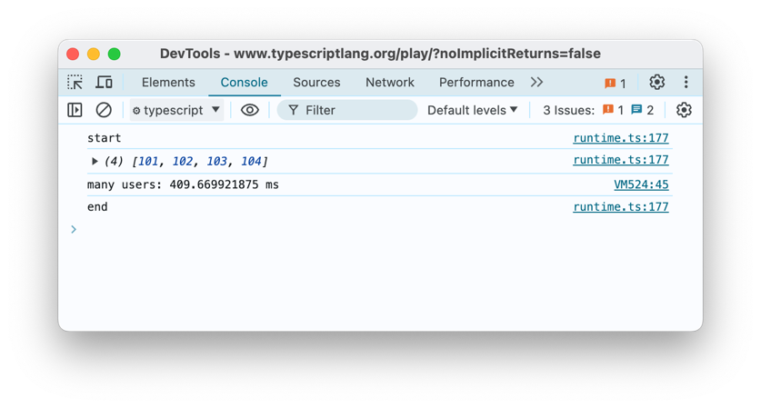

# 6。 TypeScript 的高级部分和不好的部分

本章涵盖

- 使用泛型
- 避免枚举和元组
- 应用类型缩小
- 避免异步编码的陷阱

欢迎来到 TypeScript 的迷宫世界，在这里我们浏览高级功能的曲折通道，并避开偶尔出现的常见陷阱！本章虽然可以作为你深入了解泛型、枚举、元组和异步编码的神秘艺术的指南，但它并不是普通的、枯燥的技术手册。相反，它承诺了冒险小说的刺激，深夜喜剧节目的欢笑，也许，只是也许，一个明智的老圣人（他对软件了解很多）的智慧。

现在，让我们用一点幽默来破解本章的脊柱：为什么程序员更喜欢黑暗模式？因为光会吸引虫子！说到错误，TypeScript 泛型就像代码中的错误喷雾。它们将类型检查的蚊子拒之门外，确保您的代码像瑞士军刀一样可重复使用和适应性强，而无需担心在边缘情况下割伤自己。

泛型是这个故事的英雄，它像一把剑一样挥舞着类型安全的力量，可以变形以匹配任何敌人——呃，数据类型。想象一下一个功能如此多才多艺的函数，它可以处理混合中的任何类型；可以适应字符串、数字甚至复杂物体的变形器。这不仅仅是幻想——这就是仿制药的力量！例如，我们来讨论一个简单但功能强大的通用函数：

```typescript
function identity<T>(arg: T): T {
  return arg;
}
```

在这里，`T` 不仅仅是一个字母，而是您希望传递的任何类型的占位符。这就像告诉你的函数，“做好准备，一些疯狂的事情即将到来......但不用担心，你得到了这个！”然后，您可以调用此函数以任何类型执行操作，从简单的字符串到命令行用户角色的联合：

```typescript
let output = identity<string>("Behold the mighty string!");
let userRole = identity<"admin" | "user">("admin");
```

从泛型的战场转向避免枚举和元组的阴暗角落——有时，问题不在于你使用什么，而在于你明智地选择避免什么。虽然枚举和元组有它们的位置，就像你放在壁炉上方的那把旧剑一样，但有时更简单的结构（例如联合类型）可能会更好地为你服务，在没有开销的情况下提供清晰度。

那么异步编码呢？这就像编程世界的黑暗艺术；力量强大，但如果不小心处理，就会充满危险。我们都面临过未处理的承诺拒绝的可怕野兽，这是一个常见的错误，可能会像构造不良的咒语一样使您的应用程序崩溃。以下是您如何在采取所有适当的预防措施的情况下调用异步函数：

```typescript
async function fetchData(url: string): Promise<void> {
  try {
    const response = await fetch(url);
    const data = await response.json();
    console.log("Eureka! Data retrieved:", data);
  } catch (error) {
    console.error("Alas! An error occurred:", error);
  }
}
```

当我们进一步深入本章时，请记住：TypeScript 开发人员的道路充满了选择。明智地选择，*padawan*，无论您是召唤泛型、选择退出枚举，还是涉足异步等待咒语。愿类型安全与您同在，愿您的 console.log 始终返回 true。因此，系好安全带，戴上编码手套（或护腕），让我们进入 TypeScript 高级部分和您应该避免的不良部分的神秘世界，以免您希望您的代码被过去错误的幽灵所困扰。

## 6.1.不了解泛型及其约束

现在，您可能会想，“泛型？这不就是廉价仿冒商店品牌的 JavaScript 版本吗？”接近，但不完全是。在 TypeScript 领域，泛型是我们编写可重用、适应性强和强类型代码的秘密武器 - 基本上是类型的超级英雄！这就像定义代码，但定义的是可以稍后定义的类型。类型的泛型就像函数的参数。在我们深入讨论之前，先讲一个编程幽默来缓解一下心情：为什么程序员不喜欢大自然？它的bug太多了！

TypeScript 泛型是一项功能，允许您创建可在多种类型而不是单一类型上工作的可重用代码组件。本质上，泛型提供了一种创建“类型变量”的方法，即用户在使用组件时提供的任何类型的占位符。

例如，考虑一个数组。数组可以保存任何类型的元素，但是一旦创建了数组的实例，您就会希望它能够处理特定类型，例如字符串或数字。以下是定义简单通用函数的方法：

```typescript
function identity<T>(arg: T): T {
  return arg;
}
```

在此示例中，T 是我们的类型变量。我们将它用作调用时将传递给标识函数的任何类型的占位符。这是一种说法，*“我不知道我们将使用什么类型，但我保证它会保持一致。”*

然后，您可以将该函数与特定类型一起使用，就像字符串类型一样：

```typescript
let output = identity<string>("myString");
```

或者像工会一样：

```typescript
let output = identity<"admin" | "user">("admin");
```

在本例中，我们指定要使用字符串类型的恒等函数。然后，TypeScript 将强制参数和返回值的类型为字符串。

I> 值得注意的是，在现实生活（和代码）中，显式指定像 `identity<string>("myString")` 这样的类型参数是不常见的。如果我们只写 `identity("myString")`，TypeScript 会将类型 T 推断为字符串类型（T=string）。可以将参数指定为更明确地了解正在发生的情况，并且在函数的“myString”参数实际上根本不是字符串的情况下具有额外的安全性。

泛型为 TypeScript 代码提供了更大的灵活性，同时仍然保持类型安全。它们是创建可重用组件的强大工具，可以与函数、类、接口等一起使用。

让我们深入研究更高级的泛型示例。正如我们之前所看到的，泛型函数使用类型变量作为其参数和返回类型的占位符。下面是一个带有两个相同类型参数的泛型函数的示例：

```typescript
function pair<T>(a: T, b: T): [T, T] {  // tuple [T, T]
  return [a, b];
}

let pairOfNumbers = pair(1, 2); // has type [number, number]
let pairOfStrings = pair("hello", "world"); // has type [string, string]
```

{blurb，类：信息}
在 TypeScript 中，元组是一种类型，允许您表达具有固定数量元素的数组，这些元素的类型已知，但不必相同。当您需要在单个变量中存储不同类型的值的集合并维护每个元素的顺序和特定类型时，元组非常有用。我们可以指定元组中每个元素的类型。下面是一个包含字符串和数字的元组示例：

```typescript
let person: [string, number]; 
person = ["Arun", 25]; 
```

元组的元素可以使用索引来访问，类似于数组：`console.log(person[0]);` 将输出 Arun。当我们希望函数返回不同类型的多个值并且我们不想为此使用对象时，元组通常很有用。因此，当我们需要将一些密切相关的值组合在一起，同时保持它们的不同类型和顺序时，TypeScript 中的元组是一个有用的方便功能。
{/简介}

值得指出的是，在语句中 letpairOfNumbers =pair(1,2);我们依赖 TypeScript 类型推断。正如前面提到的，这取决于是否需要明确。

我们还可以创建一个泛型类。在这个例子中，我们创建一个简单的，
具有私有属性 elements 和方法 push 和 pop 的通用 Stack 类：

```typescript
class Stack<T> {
  private elements: T[] = []; 
  push(element: T) {
    this.elements.push(element);
  }

  pop(): T | undefined {
    return this.elements.pop();
  }
}
```

当我们使用此类时，我们有一个类型安全性，当推送传递错误的参数时，它会确保出错：

```typescript
let numberStack = new Stack<number>(); 

numberStack.push(1); // OK because generic type parameter (type parameter) is a number
numberStack.push("2"); // Error: Argument of type 'string' is not assignable to parameter of type 'number'.

let stringStack = new Stack<string>(); 
stringStack.push("hello"); // OK because generic is string

stringStack.push(1); // Error: Argument of type 'number' is not assignable to parameter of type 'string'.
```

虽然您可以在函数和方法中使用泛型，但它们的行为不同并且不能直接互换。考虑以下示例，其中 MyClass 是泛型类，myFunction 是泛型函数：

```typescript
class MyClass<T> {
  data: T; 
  constructor(data: T) {
    this.data = data;
  }

  getData(): T {
    // method
    return this.data;
  }
}

function myFunction<T>(data: T): T {
  // function
  return data;
}
```

尽管它们都使用泛型类型参数 T，但 T 的范围和用法有很大不同。在 MyClass 中，T 的作用域为类，并且在整个类中可用。作为指导，如果可以的话，我们会尝试使泛型声明更接近其用法，因此如果您只需要在类的方法中使用 T，只需将其带到该方法中即可：

```typescript
class MyClass {
  getData<T>(): T {
    // method
    return this.data;
  }
}
```

另一方面，在 myFunction 中，T 的作用域仅限于该函数。尝试在其范围之外使用 T 会导致错误，因为 T 不在范围内：

```typescript
function anotherFunction(data: T): T {
  return data;
}
```

为了避免这种混乱，请始终确保在正确的范围内定义类型参数。

最后，我们还可以定义一个通用接口。例如，此 KeyValuePair 接口将键和值属性设置为泛型类型 K 和 V：

```typescript
interface KeyValuePair<K, V> {
  key: K; 
  value: V;
}
```

当我们使用这个接口时，我们可以有 K 和 V 的各种组合，TypeScript 将强制我们的类型（注意我们也可以省略显式的泛型类型参数）：

```typescript
const kv1: KeyValuePair<number, string> = { key: 1, value: "Steve" }; // OK
const kv2: KeyValuePair<string, number> = { key: "test", value: 1 }; // OK
const kv3: KeyValuePair<string, string> = { key: "test", value: 123 }; // Error: Type 'number' is not assignable to type 'string'.
```

只要我们谈论接口这个话题，这就是一个很好的笑话。更换一个灯泡需要多少个 TypeScript 程序员？ - 没有任何。这是一个硬件问题，但他们可以为其创建一个界面！

有时您可能想要限制可与泛型类一起使用的类型。这可以通过通用约束来完成，但在需要时忘记使用它们可能会导致问题。

```typescript
class MyClass<T> {
  private data: T;

  constructor(data: T) {
    this.data = data;
  }

  printDataLength() {
    console.log(this.data.length); // Error: Property 'length' does not exist on type 'T'.
  }
}
```

在这里，我们尝试使用数据的长度属性，但 TypeScript 不知道 T 是否具有长度属性。我们应该使用约束来确保 T 具有长度：

```typescript
class MyClass<T extends { length: number }> {
  private data: T;

  constructor(data: T) {
    this.data = data;
  }

  printDataLength() {
    console.log(this.data.length); // No error
  }
}
```

通过使用 { length: number } 约束，我们确保 T 始终具有 length 属性。

总而言之，在实现泛型类时，请记住一致地使用类型参数，确保所有方法也是泛型的，并在需要限制可以使用的类型时使用约束。这将帮助您避免常见的陷阱，并使您的代码更安全、更易于理解。

## 6.2.在函数中过度使用泛型

另一个常见的错误，与不使用函数的类型参数相反，是在不需要的地方过度使用泛型。过度使用泛型会使您的代码难以阅读和理解。

类型参数从根本上来说是为了在函数内的各种值的类型之间创建关系而设计的。当类型参数在函数签名中仅使用一次时，它无法建立任何关系。

**指南**：如果类型参数仅在函数签名中的单个位置使用，则应认真重新评估其必要性。通常，此类单独的类型参数可能是多余的，并且会使函数的设计变得复杂而不是简化。通过限制不必要的类型参数的使用，您可以确保代码保持干净、更易于维护且更易于理解。这种做法还增强了类型推断，让 TypeScript 能够更有效地推断类型，从而改善开发者体验。定义泛型函数时，应通过使用真正增强函数内不同数据类型的功能和交互性的类型参数来实现清晰度和效率。

让我们深入研究镜像函数的概念来说明泛型的使用：

```typescript
function mirror<T>(item: T): T {
  return item;
}
```

这是泛型的正确应用吗？在本例中，通用参数 `T` 在引入后使用了两次：

```typescript
function mirror<T>(item: T): T {
  // (dec) 1 2
  return item;
}
```

这满足了有效使用仿制药的标准。它适当地连接了两种类型，表明输入参数的类型与返回类型匹配。

考虑以下函数：

```typescript
function selectThird<X, Y, Z>(first: X, second: Y, third: Z): Z {
  return third;
}
```

这里，通用参数 `Z` 被适当使用，出现了两次。但是，`X` 和 `Y` 仅使用一次（超出其声明范围），表明其使用效率低下。该函数可以简化为仅使用一个通用参数：

```typescript
function selectThird<Z>(first: unknown, second: unknown, third: Z): Z {
  return third;
}
```

接下来，我们看一个用于解析 JSON 数据的函数：

```typescript
function parseJSON<T>(data: string): T {
  // ...
}
```

这是仿制药的有益还是有害的使用？类型参数 `T` 仅出现一次，引起关注。这种“仅返回泛型”
是有风险的，因为它们实际上等同于任何类型，尽管没有显式使用关键字 `any`：

```typescript
interface Mass {
  kilograms: number; 
  grams: number;
}

const mass: Mass = parseJSON("");
```

在此代码中，`Mass` 可以表示任何类型，并且它仍然会进行类型检查。如果您想要这种灵活性，您不妨将类型指定为 `any`：

```typescript
function parseJSON(data: string): any {
  // ...
}
```

然而，更谨慎的方法是返回 `unknown`：

```typescript
function parseJSON(data: string): unknown {
  // ...
}
```

这要求函数的用户显式断言结果的类型：

```typescript
const mass = parseJSON("") as Mass;
```

这种做法是有益的，因为它迫使您明确类型假设，消除任何类型安全的错误感觉。

让我们通过以下函数探索 TypeScript 中泛型用法的另一个示例：

```typescript
function displayValue<T, U extends keyof T>(entity: T, property: U) {
  console.log(entity[property]);
}
```

在这种情况下，泛型 `U` 仅使用一次，这可能不是泛型的最有效使用，因为 `T` 既作为参数类型又作为 `U` 的约束出现。更简化的方法是将 `keyof T` 直接合并到参数类型中并消除 `U`：

```typescript
function displayValue<T>(entity: T, property: keyof T) {
  console.log(entity[property]);
}
```

此版本通过删除不必要的泛型类型来简化函数，使函数更易于理解和维护。

现在，考虑一个稍微不同的函数：

```typescript
function fetchProperty<T, U extends keyof T>(entity: T, property: U) {
  return entity[property];
}
```

这个函数是良好通用用法的一个很好的例子。当考虑函数的返回类型时，这里的魔力是显而易见的。当您在 IDE 中检查函数签名时，您会看到其完整类型为：

```typescript
function fetchProperty<T, U extends keyof T>(entity: T, property: U): T[U];
```

返回类型是 `T[U]`，这意味着 `U` 被有效利用两次，不仅用于获取属性，还用于定义返回类型。这可确保函数在属性键与其值之间保持严格的关系，从而在整个操作过程中保持类型安全。

了解泛型的有效用法很重要。这些示例说明了使用 TypeScript 泛型的重要原则：

1. **减少冗余**：如果泛型类型不具有明确的目的或改善函数内的类型关系，
重新考虑它的用法。简化函数签名不仅可以提高可读性，还可以增强代码的可维护性。

2. **维护类型关系**：有效的泛型确保类型之间存在有意义的关系。例如，将属性键链接到对象中的值有助于维护类型安全，
使代码更加可预测和健壮。

3. **促进类型推断**：正确使用泛型可以帮助 TypeScript 的类型推断功能，使开发人员的体验更加顺畅，并减少运行时错误的可能性。

通过遵守这些原则，开发人员可以利用 TypeScript 强大的类型系统编写更清晰、更有效的代码。

编写泛型函数很有趣，而且很容易过度使用类型参数。过多的类型参数或不必要的约束可能会阻碍类型推断，导致使用函数的人感到沮丧。

## 6.3.未能使用通用实用程序类型 Pick 和 Partial

TypeScript 有一个强大的系统，可以以动态且适应性强的方式处理类型，称为通用实用程序类型。这些是 TypeScript 提供的一组通用接口，可用于操作类型。不利用这些可能会导致重复的代码、更冗长的代码、错失类型安全的机会，并且可能使正确键入更复杂的结构或操作变得更加困难。其中两种实用程序类型是 Partial 和 Pick。

Partial<Type> 类型使 Type 的所有属性都是可选的。在以下代码中，Partial<Todo> 用于类型 fieldsToUpdate。这允许我们提供具有 Todo 属性的任何子集的对象。因此，Partial<Todo> 使 Todo 的所有属性都是可选的。

```typescript
interface Todo {
  title: string; 
  description: string;
}

function updateTodo(todo: Todo, fieldsToUpdate: Partial<Todo>) {
  return { ...todo, ...fieldsToUpdate };
}
```

Pick<Type, Keys>：允许您通过从 Type 中选取一组属性 Keys 来创建新类型。

```typescript
type TodoPreview = Pick<Todo, "title">;
```

在此示例中，Pick<Todo, 'title'> 创建一个新类型 TodoPreview，仅包含 Todo 中的 title 属性。此方法在对象关系映射库和 API 响应中非常方便，我们只需要返回一些属性而不是整个对象。

考虑下面的代码，我们在其中声明一个接口类型 Person、用于记录信息的函数，然后使用它们：

```typescript
interface Person {
  name: string; 
  age: number; 
  address: string;
}

function logPersonNameAndAge(person: Person) {
  console.log(person.name, person.age);
}

const person: Person = { name: "Alice", age: 25, address: "Wonderland" }; 
logPersonNameAndAge(person);
```

在这个例子中，logPersonNameAndAge并不关心Person中的地址字段，它只需要姓名和年龄，但我们在调用函数时被迫提供所有三个属性（姓名、年龄和地址）。我们可以使用 Pick 实用程序类型使该函数仅使用必要的数据：

```typescript
function logPersonNameAndAge(person: Pick<Person, "name" | "age">) {
  console.log(person.name, person.age);
}

const person = { name: "Alice", age: 25 }; 
logPersonNameAndAge(person); // This now works without `address`
```

在这个修改后的示例中，logPersonNameAndAge 现在接受一个只需要具有姓名和年龄的对象。因此，我们在调用该函数时不必提供不必要的字段。这种 Pick 方法更正确（最小权限原则），并且当您没有该地址时也更方便。

现在，转向部分。这里，不使用它的错误可能会导致_重新实现_可以使用实用程序类型实现的类型（功能）。这可能会导致代码更加冗长且难以维护。哎哟!

例如，考虑这种类型，其中 Person 的所有字段都是可选的：

```typescript
type OptionalPerson = {
  name?: string; 
  age?: number; 
  address?: string;
};

// ...rest of the code...
```

在此代码中，OptionalPerson 本质上是一个 Person，其中所有字段都是可选的。这是一个常见的要求，但手动实现它是多余的，因为 TypeScript 提供了 Partial 实用程序类型：

```typescript
type OptionalPerson = Partial<Person>; 
// ...rest of the code...
```

在此修订后的代码中，OptionalPerson 是使用 Partial<Person> 定义的，它实现了相同的结果，但更短且更易于理解。但最重要的是，当它发生变化时，它将保留下来并在将来获取 Person 类型的所有新更改（保持“同步”）。

在 TypeScript 中，通用实用程序类型 Pick 和 Partial 是一组预定义类型，可用于对其他类型执行转换。这些实用程序类型可以帮助简化类型定义并使其更具表现力。在适当的时候忽视使用它们可能会导致不必要的代码冗长、重复和潜在的类型错误。通过利用 Pick 和 Partial 等通用实用程序类型，我们可以编写更简洁、更容易理解、更灵活的 TypeScript 代码。

## 6.4.不理解泛型中的条件类型

在 TypeScript 中，条件泛型类型允许您定义根据应用于其参数的条件而变化的类型。在您需要根据输入类型动态强制执行特定类型关系的情况下，这些类型可能特别强大。下面的示例说明了如何在实际场景中使用条件泛型类型：

我们将从条件泛型类型的基本示例开始。假设您要创建一个实用程序类型来检查类型是否扩展了 `number`，并根据该条件将该类型转换为 `string` 或保持不变。以下是定义和使用此类条件类型的方法：

```typescript
type NumberToString<T> = T extends number ? string : T;

// Usage
type A = NumberToString<number>; // A is string
type B = NumberToString<string>; // B is string
```

在此示例中，`NumberToString` 检查 `T` 是否是 `number` 的子类型。如果 `T` 为 `number`，则解析为 `string`；否则，它将解析为原始类型 `T`。

让我们创建一个更实际的示例，其中函数根据其输入参数的类型返回不同的类型。此函数 `wrapValue` 将返回一个对象，该对象包含值的 `string` 表示（如果它是 `number`）或值本身（如果它是任何其他类型）。

```typescript
type WrapType<T> = T extends number ? { type: "number"; value: string } : { type: "other"; value: T };

function wrapValue<T>(value: T): WrapType<T> {
  if (typeof value === "number") {
    return { type: "number", value: value.toString() } as WrapType<T>;
  } else {
    return { type: "other", value: value } as WrapType<T>;
  }
}

// Example usages
const wrappedNumber = wrapValue(10); // Type is { type: 'number'; value: string; }
const wrappedString = wrapValue("hello"); // Type is { type: 'other'; value: string; }

console.log(wrappedNumber); 
console.log(wrappedString);
```

在这个例子中：

- `WrapType<T>` 使用条件类型根据 `T` 是否是 `number` 来确定返回类型的结构。
- `wrapValue` 函数检查 `value` 的运行时类型并相应地构造返回对象。
- TypeScript 根据输入类型正确推断返回值的类型，演示条件类型如何动态影响程序中的类型流。

条件泛型类型是 TypeScript 中的一项强大功能，它允许开发人员根据应用的条件动态调整类型，从而编写类型更安全、更灵活的代码。

在 TypeScript 中，`extends` 关键字确实是定义条件类型的核心，但重要的是要澄清，在此上下文中的 `extends` 的功能与传统面向对象编程中的继承并不完全相同。相反，条件类型中的 `extends` 充当类型约束，检查一个类型是否可以分配给另一个类型，充当条件检查而不是表示扩展或继承。

接下来，让我们深入研究 `extends` 条件类型。 `extends` 关键字在 TypeScript 的条件类型中用于评估类似于“if-else”结构的条件。语法如下：

```typescript
type ConditionalType = TypeA extends TypeB ? TypeC : TypeD;
```

在这个语法中：

- `TypeA` 和 `TypeB` 是类型。

- `TypeA extends TypeB` 检查 `TypeA` 是否可以分配给 `TypeB`。

- 如果 `TypeA` 可分配给 `TypeB`，则条件类型解析为 `TypeC`。

- 如果不是，则解析为 `TypeD`。

还有其他条件运算符吗？虽然 TypeScript 没有像在条件类型中使用 `extends` 那样的其他“条件运算符”，但该语言确实支持用于创建复杂类型行为的其他运算符和技术：

- **映射类型**：这些允许您通过以依赖于属性的键和值的方式转换现有类型的属性来创建新类型。

- **实用程序类型**：TypeScript 提供了多种内置实用程序类型（如 `Partial<T>`、`Readonly<T>` 和 `Pick<T, K>`），它们以各种方式修改类型，有时可以根据输入类型实现“条件”效果。

- **交集和联合类型**：这些可用于通过相交（`TypeA & TypeB`）或允许多种类型中的任何一种（`TypeA | TypeB`）来组合多种类型。

最后，我们来看一个使用组合类型操作的示例。下面的示例展示了如何组合各种类型操作来创建复杂的行为，而无需使用其他条件运算符：

```typescript
type Admin = {
  name: string; 
  privileges: string[];
};

type User = {
  name: string; 
  email: string;
};

// Conditional type that checks the presence of 'privileges' property
type Staff<T> = T extends { privileges: any[] } ? Admin : User;

// Using a mapped type within a conditional expression
type Optional<T> = {
  [P in keyof T]?: T[P];
};

type OptionalAdmin = Optional<Staff<Admin>>; // Partial properties;

type OptionalUser = Optional<Staff<User>>; // Partial properties;

// Union type that allows function to accept either type
function setupProfile(user: Admin | User) {
  // Function implementation
}
```

总之，虽然 `extends` 是在 TypeScript 中创建条件类型的主要工具，但该语言的类型系统提供了一组丰富的用于操作类型的工具，这些工具组合起来可以模仿各种条件行为并创建高度动态的类型条件。

## 6.5.使用枚举代替联合类型

有时，使用联合类型比枚举更容易。这是一个不需要枚举的示例：

```typescript
enum Color {
  Red,
  Green,
  Blue,
}
function paint(color: Color) {
  // ...
}
paint(Color.Red);
```

相反，联合类型可以简化代码：

```typescript
type Color = "Red" | "Green" | "Blue";
function paint(color: Color) {
  // ...
}

paint("Red");
```

它更简单，并且不会向运行时 JavaScript 添加不必要的符号。此外，一些 TypeScript 大师，比如《Effective TypeScript》的作者 Dan，甚至会说枚举是 TypeScript 的一个糟糕部分（类似于著名的《JavaScript The Good Parts》一书）。这是为什么？
它会给你一种类型安全的错觉。考虑这个具有相同 Color 枚举的示例：

```typescript
enum Color {
  Red,
  Green,
  Blue,
}

let c: Color;

c = 1; // ok
console.log(Color[c]); // Green
c = 2 + 10; // ok
console.log(Color[c]); // undefined
```

一般来说，我建议使用联合，除非必须使用枚举。这是因为在特定情况下，人们可能会选择联合类型而不是枚举，原因有多种：

- 简单性和可读性：联合类型通常提供比枚举更简单、更类似于 JavaScript 的语法。它们允许您直接使用您关心的值（“Car”、“Truck”等），而不是通过枚举（VehicleType.Car、VehicleType.Truck 等）引用它们。这可以使代码更具可读性，尤其是在 TypeScript 转换为 JavaScript 之后。

- 基于字符串的值：如果您的常量集是基于字符串的，则使用联合类型可以使您的代码与实际使用的值更加一致。当枚举被转换为 JavaScript 时，值就变成了数字，这可能没有什么意义。另一方面，基于字符串的联合类型保留其值，使 JavaScript 输出更容易理解。

- 灵活性：联合类型比枚举更灵活，因为它们可以表示任何类型，而不仅仅是数字或字符串值。例如，联合类型可用于表示可以是数字或特定字符串的值。

- 更小的 JavaScript 输出和性能影响：枚举是 JavaScript 中不存在的 TypeScript 功能，TypeScript 通过生成额外的代码来模拟它们。这可能会导致更大的 JavaScript 输出，特别是如果您有很多枚举。另一方面，联合类型利用现有的 JavaScript 构造，并且不会向 JavaScript 输出添加任何额外的代码。

- 与外部库或 API 一起使用：在使用 JavaScript 库或外部 API 时，您可能会处理原始值（通常是字符串）。在这种情况下，使用联合类型会更方便并且更不容易出错，因为您不需要将原始值映射到相应的枚举成员。

值得注意的是，当您有大量相关常量时，枚举仍然是一个不错的选择，特别是当您需要迭代它们时，或者当数字枚举的自动递增行为很有用时。

I> 如果您不熟悉枚举（enumerations 的缩写），它是 TypeScript 中的一项功能，允许我们定义一组命名常量。它们是一种为数字或字符串值集提供更友好和一致（来自 const 一词）名称的方法。因此，枚举或枚举是一种特殊类型，由一组命名常量组成。这就像将“星期一”声明为 1，将“星期二”声明为 2...但说实话，我们都宁愿将“星期一”声明为“仍然周末”，不是吗？

在 TypeScript 中，枚举是一种特殊类型，用于定义相关值的集合。这可以是数字或字符串值。

让我们看一个基本的数字枚举：

```typescript
enum Direction {
  Up,
  Down,
  Left,
  Right,
}
```

默认情况下，枚举编号从 0 开始。因此，Direction.Up 将为 0，Direction.Down 将为 1，依此类推。您还可以手动为枚举成员分配值。例如：

```typescript
enum Direction {
  Up = 1,
  Down,
  Left,
  Right,
}
```

在这种情况下，Direction.Up 将为 1，Direction.Down 将为 2，依此类推。 TypeScript 会自动将以下成员加 1。

TypeScript 还支持字符串枚举，我们为成员提供一个字符串值：

```typescript
enum Direction {
  Up = "UP",
  Down = "DOWN",
  Left = "LEFT",
  Right = "RIGHT",
}
```

在这种情况下，Direction.Up 将为“UP”，Direction.Down 将为“DOWN”，依此类推。

现在，TypeScript 如何将枚举转换为 JavaScript？让我们以第一个数字枚举示例为例，看看 TypeScript 会生成什么：

```typescript
var Direction;

(function (Direction) {
  Direction[(Direction["Up"] = 0)] = "Up";
  Direction[(Direction["Down"] = 1)] = "Down";
  Direction[(Direction["Left"] = 2)] = "Left";
  Direction[(Direction["Right"] = 3)] = "Right";
})(Direction || (Direction = {}));
```

正如您所看到的，TypeScript 生成一个自调用函数，该函数用我们的枚举成员填充一个对象。它使枚举成员可以双向使用：您可以从数值中获取字符串名称，也可以从字符串名称中获取数值。

JavaScript 没有对枚举的内置支持，但可以使用对象来模拟它们，就像 TypeScript 将枚举类型编译为 JavaScript 时所做的那样。

TypeScript 枚举（有时）提供类型安全和自动完成功能，这可以使我们的代码不易出错且更易于理解。但请记住，由于枚举成为 JavaScript 中的对象，因此它们会为最终的 JavaScript 包添加额外的抽象层和额外的代码。如果性能是项目的一个关键方面，您可能需要使用简单常量或其他类型安全的替代方案（例如联合类型）。

## 6.6.尽可能不用对象替换元组

元组是 TypeScript 中的一个强大工具，用于表示固定数量的潜在不同类型的元素。然而，当它们用来代替语义上更有意义的结构时，它们可能会被误用。让我们更详细地探讨这一点。

考虑以下误用示例，其中我们使用元组 userInfo 来存储 ID 和名称：

```typescript
let userInfo: [number, string] = [12, "Alejandro Gabriel Torres Garcia"];
console.log(userInfo[0]); // Output: 12
```

此代码片段有效，我们有一个名为 userInfo 的元组，它表示用户信息。但不清楚 userInfo[0] 和 userInfo[1] 的含义。它们可以是 ID、姓名、超级英雄身份等。该代码缺乏上下文和可读性。更好的解决方案是使用对象：

```typescript
let userInfo = {
  id: 12,
  name: "Alejandro Gabriel Torres Garcia",
};
console.log(userInfo.id); // Output: 12
```

这段代码更容易阅读和理解。通过使用对象，我们提供有意义的属性名称（id 和 name），以明确每个值代表什么。这提高了代码的可读性和可维护性，特别是当数据结构的复杂性增加时。

使用对象而不是元组可以使我们获得更好的代码可读性（对于人类读者而言）。我们可以定义接口或类型来强制对象的结构，提供自动完成建议，并执行类型检查：

```typescript
interface UserInfo {
  id: number;
  name: string;
}

let userInfo: UserInfo = {
  id: 1,
  name: "Alejandro Gabriel Torres Garcia",
};

console.log(userInfo.id); // Output: 1
```

通过接口或类型定义，我们对对象的形状有了更清晰的契约，使其他开发人员更容易理解和使用代码。

{blurb，类：信息}
元组支持标签以提高可读性。在 TypeScript 中，元组标签（也称为“带标签的元组元素”）是一项功能，它允许您为元组的元素分配名称，从而增强元组类型的可读性和文档记录。这些标签不会改变元组的行为；它们只是提供了一种方法来记录元组中每个位置的含义，使代码更易于理解。以下是定义和使用标记元组的方法：

```typescript
type Customer = [id: number, name: string, age: number];

let customer: Customer = [1, " Alejandro", 30]; // Corresponds to [id, name, age];

console.log(customer[1]); // Alejandro
```

在上面的示例中，元组 `Customer` 定义了每个元素的标签。标签为 `id`、`name` 和 `age`，分别对应于 `number`、`string` 和 `another number`。
{/简介}

考虑一个返回表示 API 响应的元组的函数。使用标签可以阐明元组中每个元素的含义：

```typescript
function fetchUserData(): [status: number, body: string] {
  // Imagine this function makes an API call and returns status and body
  return [200, '{"name":"Alice", "age":30}'];
}

const [statusCode, responseBody] = fetchUserData();

console.log(statusCode); // 200
console.log(responseBody); // '{"name":"Alice", "age":30}'
```

在此函数中，`fetchUserData` 返回一个包含两个标记元素的元组。使用标签 `status` 和 `body` 可以清楚地了解元组的每个部分包含的内容，从而增强解构行和后续使用的可读性。虽然元组标签不会影响元组的功能，但它们是使代码更易于理解和维护的强大工具。因此，它们在数据结构和意图的清晰度至关重要的复杂系统中特别有用。

虽然我个人建议只使用对象并将元组视为 TypeScript 的糟糕部分，但如果您使用 TypeScript 的时间足够长，您仍然会在其他人的代码中遇到元组。让我们尝试看看 TypeScript 中元组和对象之间的差异，看看它们是否真的是两种不同的数据结构，服务于不同的目的（或者需要去看看你，元组！）。以下是元组和对象之间的比较（了解它们的差异和用例对于有效的 TypeScript 开发非常重要）：

元组：

- 元组是不同类型元素的有序集合。元组中的每个元素都可以有自己的类型，并且元素的顺序是固定的。

- 元组类型使用方括号[]定义，并用逗号分隔元素类型。

- 当您想要表示元素的顺序和类型很重要的值的集合时，元组就可以了。例如，表示坐标 (x, y) 或返回平均值和计数的 getStats 函数。

- 可以使用从 0 开始的数字索引来访问元组元素。

- 元组具有固定长度，类型系统强制元组中元素的预期数量。

- 当使用需要接受或返回不同类型的多个值的函数时，通常会使用元组。

- 即使有元组标签，元组也不提供 JavaScript 代码中值的描述。当我们定义带有标签的元组类型时，我们为每个元素指定一个名称及其类型。它们有助于提高代码可读性，但仅限于 TypeScript 代码（而不是生成的 JavaScript 代码）。

对象：

- 对象是键值对的无序集合。对象中的每个值都可以有自己的类型，并且不保证属性的顺序。

- 对象类型使用大括号 {} 定义，并指定属性的类型及其名称。

- 当您想要表示键和值之间的关联很重要的结构化数据时，对象是合适的。例如，用姓名、年龄和地址等属性表示一个人的信息。

- 可以使用点符号 (object.property) 或方括号符号 (object['property']) 使用其名称（键）来访问对象属性。

- 对象可以具有动态属性，这意味着您可以在运行时添加或删除属性。

- 在使用 API、JSON 数据或对具有各种属性的复杂实体进行建模时，通常会使用对象。

总之，当元素的顺序及其类型很重要时，使用元组，而对象则用于键值对的无序集合。在元组和对象之间进行选择取决于您需要表示的数据的具体要求和结构。

虽然元组有其用例，但重要的是要考虑它们是否是最合适的选择。在处理结构化数据时，使用具有明确定义的属性的对象可以极大地提高代码的清晰度、可维护性，并有效地利用 TypeScript 的类型系统。

## 6.7.不知道各种类型的缩小技术

现在请花点时间思考一下作为一名 TypeScript 开发人员的感受。有一天，您在云中翱翔，以芭蕾舞演员表演大型喷气式飞机的精确度声明类型，而第二天您就会陷入流沙，纠结在未定义变量和联合类型的网络中，就像寿司一样混合在一起比萨。

你低头一看，就在那里——一个警告。一条愤怒的红色下划线对你大喊：“对不起，但你不能‘假设’我会是这种类型！”就像一个爱争论的幼儿对“不”这个词产生了新的痴迷一样，TypeScript 有时看起来更像是一个顽固的障碍，而不是一个有用的指南。但是，如果我们告诉您有一种方法可以将僵化、顽固的 TypeScript 转变为温顺、合作的盟友，该怎么办？输入 Type Guards 和 Type Narrowing，TypeScript Malibu 海滩的双胞胎救生员。

这些智能型防护装置可以区分联合型晚餐中的“披萨”和“寿司”，因此您的功能不会意外地将酱油淋在玛格丽塔上。 （虽然这听起来像是......毕竟可能很好吃？！现在，我很想尝试一下！）他们可以区分鱼和鸟，确保你的 Swim() 函数不会以扑腾而告终麻雀。这就像拥有一副眼镜，可以洞察代码的核心并识别类型的真正本质。

类型保护会提出一些棘手的问题，例如“这个变量真的是一个数字吗？”或者“你绝对确定这个对象是 Student 类的实例吗？” - 在你的代码敢于做出信仰的飞跃之前，先对其进行考验。

```typescript
const { pageCount } = request.data;

import student from "@repo/seeders";

//...

// param could be pageCount or student?!

if (typeof param === "number") {
  // TypeScript now knows it's a number so we can pass it as-is to the database query
}

if (typeof param === "object") {
  // It's an object, not a number!
}
```

使用类型保护，我们可以避免很多运行时错误。啊，在一个类型检查错误已被驱逐到最远的虚空的世界里编程的乐趣！坚持住，记住——在 TypeScript 的世界里，事情并不总是它们所输入的那样！我们将介绍几种技术：

- 代码中的 if/else 条件
- 类型谓词函数，又名自定义类型防护

对于所有这些，我们通常会使用以下方法之一（或它们的组合）检查类型：

- `typeof`
- `instanceof`

- 相等性，特别是对于文字以及空和未定义的检查
- `in` 运算符用于检查对象上的属性和方法是否存在（存在）
- 受歧视的工会：检查共同财产
让我们一一看看 TypeScript 中类型缩小的这些主要技术。

`typeof` 保护：对于 `string`、`number` 等原语很有用，
`boolean` 和 `function`。

```typescript
function padLeft(padding: number | string, input: string) {
  if (typeof padding === "number") {
    return new Array(padding + 1).join(" ") + input;
  }
  return padding + input;
}

console.log(padLeft(10, "hello world")); // Output: " hello world"
console.log(padLeft(".....", "hello world")); // Output: ".....hello world"
```

啊，typeof 运算符。有时，它是你在 TypeScript 中最好的朋友，在穿越数据类型的迷宫时充当有用的指南。但其他时候，它是一个狡猾的骗子，可能会引导你陷入陷阱，让你深陷类型错误和混乱之中。那么，让我们揭开 typeof 运算符滥用背后的谜团。

让我提供一些有关 TypeScript（和 JavaScript）中 typeof 的背景信息。我们使用 typeof 运算符来获取变量、属性或值的类型。该运算符返回一个表示类型的字符串。例如，

```typescript
console.log(typeof "Hello World"); // Outputs: "string"
console.log(typeof 42); // Outputs: "number"
console.log(typeof true); // Outputs: "boolean"
console.log(typeof undefined); // Outputs: "undefined"
```

看起来简单又方便，不是吗？对于_primitive_类型来说当然是这样。然而，typeof 运算符并不总是那么简单。
当我们尝试将 typeof 与以下类型一起使用时，它会变得很棘手：

- 用户定义的类型和接口
- 空值
- 数组
- 功能
对于用户定义的类型和接口，typeof 运算符无法满足需要。这是因为 typeof 是一种 JavaScript 构造，它在 TypeScript 中得以保留。由于向后兼容性的要求，将旧的丑陋的坏部分迁移到新版本对于其他语言来说也很常见（Java 21 是另一个例子，它具有一些更现代的 Kotlin 中不存在的陈旧结构）。所以 typeof 是 JavaScript 的东西，它对于用户定义的类型或接口确实没有多大作用。

考虑下一个片段，它定义了包含姓名和年龄的 Student 接口，然后创建此学生类型的实例，仅让 typeof 返回通用对象：

```typescript
interface Student {
  name: string;
  age: number;
}

let alena: Student = { name: "Alena", age: 21 };
console.log(typeof alena); // Outputs: "object", not "Student"
```

在这里，即使 alena 的类型为 Student，typeof 运算符也会返回“object”。它无法区分自定义类型或告诉您何时处理特定接口。如果您期待“学生”，这可能会导致类型错误。为了缓解这个问题，我们必须使用本章上一节中介绍的类型保护技术之一，例如instanceof、“in”或可区分联合。

typeof 运算符的另一个陷阱是它如何处理空值。

```typescript
let something = null;
console.log(typeof something); // Outputs: "object", not "null"
```

虽然 null 被认为是原始类型，但 typeof null 会令人困惑地返回“object”。如果处理不当，这可能会造成混乱并导致潜在的错误。为了避免这个陷阱，只需使用严格检查（三重等于）比较：something === null。

接下来是处理数组和函数。虽然从技术上讲是正确的，但 typeof 对于数组返回“object”，对于函数返回“function”，这可能不是您正在寻找的粒度。

```typescript
console.log(typeof [1, 2, 3]); // Outputs: "object"
// Function factory for defining an object 'Person'
function Person(name: string, age: number) {
  return {
    name: name,
    age: age,
    sayHello: function () {
      console.log(`Hello, my name is ${this.name} and I am ${this.age} years old.`);
    },
  };
}

console.log(typeof Person); // Outputs: "function"
```

顺便说一句，相同的 typeof 输出函数发生在类上，这可能不是我们所期望的：

```typescript
class Person {
  name: string;
  age: number;

  constructor(name: string, age: number) {
    this.name = name;
    this.age = age;
  }

  sayHello() {
    console.log(`Hello, my name is ${this.name} and I am ${this.age} years old.`);
  }
}

console.log(typeof Person); // Outputs: "function"
```

如果您是 JavaScript 新手，您可能会惊讶地发现数组是一个对象（实际上是一个哈希图），而类是一个函数。你到底能说什么？ JavaScript 你醉了吗？好吧，也许吧，但那是另一个故事了，第一个版本是如何在 1995 年用 11 天开发出来的，而几乎所有不好的部分仍然保留到今天。无论如何，回到类型。

我们获取数组的对象类型，因为在底层，数组类型是 JavaScript 中一种特殊的对象类型（关联）。就函数而言，JavaScript 类并不是真正的类，而是创建原型继承的函数的语法糖。此外，JavaScript 将函数视为一等对象，使它们能够作为参数传递给其他函数、从函数返回以及存储在变量和属性中。与常规对象一样，函数可以拥有属性和方法，但其显着特征在于其可调用性，允许在执行过程中调用它们。

因此，我们已经拥有了我们所拥有的，为了缓解 typeof 与数组和函数的不足，我们可以使用以下方法之一，所有这些方法都输出 true：

```typescript
const arr = [1, 2, 3];

console.log(Array.isArray(arr)); // good
console.log(arr instanceof Array); // good
console.log(arr.constructor === Array); // meh
console.log(Object.prototype.toString.call(arr) === "[object Array]");
// ugly
```

{blurb，类：信息}
要检查变量是否是类（函数），我们可以使用此 hack，它使用正则扩展在所考虑的函数的文本表示中查找关键字 class：

```typescript
const isClass = (fn: Function) => /^s*class/.test(fn.toString());

class Person {
  name: string;
  age: number;

  constructor(name: string, age: number) {
    this.name = name;
    this.age = age;
  }

  sayHello() {
    console.log(`Hello, my name is ${this.name} and I am ${this.age} years old.`);
  }
}

console.log(isClass(Person)); // Outputs: true
```

是的，它并不漂亮和老套，但它可以展示 JavaScript 和 TypeScript 的强大功能和灵活性，幸运的是，这种需求在 JavaScript 和 TypeScript 中并不经常出现。
{/简介}

总之，虽然 typeof 运算符在正确使用时是一个强大的工具，但它也有其局限性和怪癖。滥用它可能会导致微妙的错误、类型错误和混乱。了解这些陷阱将帮助您更有效地使用 typeof 运算符并编写更清晰、不易出错的 TypeScript 代码。

`instanceof` 保护：在处理类实例时可用于缩小类型范围。例如，我们有两个类 Bird 和 Fish，并且需要在两者上使用相同的 move 函数：

```typescript
class Bird {
  fly() {
    console.log("Flap Flap");
  }
}

class Fish {
  swim() {
    console.log("Slosh");
  }
}

function move(animal: Bird | Fish) {
  if (animal instanceof Bird) {
    animal.fly();
  } else {
    animal.swim();
  }
}
```

检查相等性（如 `===`、`!==`、`==`、`!=`）也可用于缩小类型范围，尤其是文字和 `null`/`undefined` 检查。

```typescript
function processRequest(url: string | null) {
  if (url === null) {
    console.error("The URL is null.");
    return;
  }

  // TypeScript now knows `url` is a `string` not `null`.
  fetchData(url);
}
```

`in` 关键字检查对象上属性是否存在，并可用作类型保护。

```typescript
type Fish = { swim: () => void };
type Bird = { fly: () => void };

function move(animal: Fish | Bird) {
  if ("swim" in animal) {
    animal.swim();
  } else {
    animal.fly();
  }
}
```

用法如下，为鱼和鸟类型的宠物创建特定对象，然后使用相同的函数在它们上移动：

```typescript
const finDiesel: Fish = {
  swim() {
    console.log("Slosh");
  },
};

const wingstonChurchill: Bird = {
  fly() {
    console.log("Flap Flap");
  },
};

move(wingstonChurchill); // "Flap Flap"

move(finDiesel); // "Slosh"
```

受歧视的工会涉及工会所有成员共享的共同财产（歧视）。此属性具有文字类型，TypeScript 可以使用它来缩小正确类型的范围。

```typescript
type Event = { kind: "click"; x: number; y: number } | { kind: "keypress"; key: string };

function handleEvent(event: Event) {
  if (event.kind === "click") {
    console.log(`Click at (${event.x}, ${event.y})`);
  } else {
    console.log(`Key pressed: ${event.key}`);
  }
}
```

I> 歧视性工会的名称与对不同类别的人的不公正或偏见待遇无关。相反，它来自“判别”一词。在数学中，多项式的判别式是一个取决于系数的量，并且允许在不计算根的情况下推导出根的某些属性。

因此，所有这些技术都可以直接在函数中使用来缩小类型范围，或者可以将它们抽象为一个单独的函数，以便更好地重用代码（当您多次需要此类型保护时）。这些特殊函数充当自定义类型保护函数或谓词，因为它们使用类型谓词“is”。因此，我们可以通过编写使用类型谓词 (`arg is Type`) 作为返回类型的函数来定义自定义类型保护：

```typescript
function isFish(animal: Fish | Bird): animal is Fish {
  return (animal as Fish).swim !== undefined;
}

function move(animal: Fish | Bird) {
  if (isFish(animal)) {
    animal.swim();
  } else {
    animal.fly();
  }
}

const finDiesel: Fish = {
  swim() {
    console.log("Slosh");
  },
};

const wingstonChurchill: Bird = {
  fly() {
    console.log("Flap Flap");
  },
};

move(wingstonChurchill); // "Flap Flap"
move(finDiesel); // "Slosh"
```

我们刚刚看到的示例的工作方式与之前的鱼和鸟示例非常相似，但当然有一个很大的优点，即现在我们有一个单独的 isFish 函数可以从不同的地方多次调用。我通常将这些函数放在一个共享库中，可以从项目的不同部分甚至不同的项目访问。

与类型缩小有些相关的是两个断言：非空断言运算符！和类型断言运算符“as”。非空断言运算符告诉 TypeScript 表达式不为空或未定义。

```typescript
function process(id: string | undefined) {
  const processedId = id!.trim(); // We are sure `id` is not `undefined` here.
}
```

类型断言可用于告诉 TypeScript 您比 TypeScript 本身更了解该类型。它基本上是最后的手段，也是放弃并放置 //ts-ignore 或 //ts-expect-error 的一步。

```typescript
let someValue: any = "this is a string";
let strLength: number = (someValue as string).length;
```

除其他外，这些技术使 TypeScript 开发人员能够动态、安全地管理和操作类型，严格遵守应用程序对类型正确性和安全性的要求。

## 6.8.对非类使用“instanceof”

当我们深入研究 TypeScript 的工具箱时，我们会遇到 instanceof 运算符。作为类门口的哨兵，instanceof 是一个二元运算符，用于测试对象是否是类的实例。

然而，就像它的表亲 typeof 一样，如果误用或误解，instanceof 也会带来困惑和冲突。让我们解开这些错综复杂的线索，并探讨 TypeScript 中 instanceof 的不当使用。

让我向您介绍一下有关 instanceof 的背景知识。 instanceof 运算符期望左侧操作数是一个对象，右侧操作数是类的构造函数。下面的代码演示了 TypeScript 中简单类的用法，并说明了实例和继承的概念。

该代码首先定义一个名为 Cat 的类。 Cat 类有一个名为 meow() 的方法，用于记录“Meow!”调用时到控制台。定义 Cat 类后，代码使用 new 关键字创建该类的新实例。新的对象 kitty 是 Cat 类的实例，是使用基于 Cat 类蓝图（也称为原型继承）的 new Cat() 语法创建的。

然后，代码使用instanceof运算符检查kitty对象是否是Cat类的实例：

```typescript
class Cat {
  meow() {
    console.log("Meow!");
  }
}

let kitty = new Cat();
console.log(kitty instanceof Cat); // Outputs: true
```

如果左侧操作数（本例中为 kitty）是右侧操作数（本例中为 Cat）的实例，则 instanceof 运算符返回 true。由于我们使用 new Cat() 语法创建了 kitty 对象，因此它确实是 Cat 类的实例。因此，console.log() 语句的输出将为 true。总而言之，kitty 是 Cat 的一个实例，世界上一切都是对的。

现在，让我们深入研究一些示例，说明何时 instanceof 可能会导致您误用误用案例及其后果。首先，我们将介绍原始类型。 instanceof 运算符用于判断一个对象是否是某个类的实例。如果您尝试将其与数字、字符串或布尔值等基本类型一起使用，它将始终返回 false。我们还会得到错误：“‘instanceof’表达式的左侧必须是‘any’类型、对象类型或类型参数”：

```typescript
console.log("Hello World" instanceof String); // Outputs: false
console.log(42 instanceof Number); // Outputs: false
console.log(true instanceof Boolean); // Outputs: false
```

即使文字看起来与类型匹配，instanceof 也会返回 false，因为这些基元不是其各自包装类（Number、String、Boolean）的实例。有趣的是，如果我们将原语更改为包装对象实例，我们将在所有三个语句中得到 true：

````typescript
console.log(new String("Hello World") instanceof String); // Outputs: true;
console.log(new Number(42) instanceof Number); // Outputs: true
console.log(new Boolean(true) instanceof Boolean); // Outputs: true ```
````

因此，在将instanceof与原语一起使用时我们需要谨慎。

{blurb，类：信息}
JavaScript（以及编译为 JavaScript 的 TypeScript）中的对象包装器是包装原始值（例如字符串、数字和布尔值）的特殊类型的对象。 JavaScript 提供了 String、Number 和 Boolean 等构造函数，可用于创建基元的对象版本。这些与原始值本身不同。这是使用对象包装器的示例。
在此示例中，strPrimitive 是原始字符串，而 strObject 是包装该字符串的对象。

```typescript
let strPrimitive = "hello";
let strObject = new String("hello");
console.log(typeof strPrimitive); // Outputs "string"
console.log(typeof strObject); // Outputs "object"
```

建议_避免_使用对象包装器。
{/简介}

接下来，我们来谈谈接口和自定义类型。 instanceof 运算符只能检查对象是否是类的实例。它无法检查对象是否遵循接口或自定义类型。这是因为接口和类型仅在编译时存在以进行静态类型检查，而在运行时不存在。假设我们有一个带有方法 bark 的接口 Dog。这就是狗所做的，对吧？然后，我们尝试确定 AcceptPet 函数内部 pet 参数的实例，结果却收到错误“‘Dog’ 仅指类型，但在这里被用作值”：

```typescript
interface Dog {
  bark(): void;
}

function adoptPet(pet: Dog) {
  if (pet instanceof Dog) {
    // Error: 'Dog' only refers to a type, but is being used as a value here.
    console.log("Adopted a dog!");
  }
}
```

上面的代码会给你一个编译错误，因为你不能使用带有instanceof运算符的接口。这只是因为接口在运行时不存在。它们纯粹是 TypeScript 时的构造，在编译时被剥离。正确的方法是检查宠物是否属于特定类型。因此，我们需要创建一个实现 Dog 接口的 CaucasianShepherd 类，然后在 acquirePet 中使用该类：

```typescript
interface Dog {
  bark(): void;
}

class CaucasianShepherd implements Dog {
  bark() {
    console.log("woof woof");
  }
}

function adoptPet(pet: any) {
  if (pet instanceof CaucasianShepherd) {
    console.log("Adopted a dog!");
  } else {
    console.log("Adopted an alien");
  }
}

adoptPet(new CaucasianShepherd());
adoptPet(new Array(1, 2, 3));
```

如果您仍然想检查对象 pet 是否遵循 Dog 接口，那么我们可以使用鸭子类型。例如，我们可以检查 bark 方法：

```typescript
interface Dog {
  bark(): void;
}

function adoptPet(pet: any) {
  if (typeof pet.bark === "function") {
    console.log("Adopted a dog!");
    pet.bark();
  }
}
```

{blurb，类：信息}
“鸭子类型”是计算机编程中使用的一个概念，特别是在 Python 和 JavaScript 等动态语言中。它指的是一种类型系统，其中对象的方法和属性决定其语义的有效性，而不是它从特定类的继承或特定接口的实现。鸭子类型在 Ruby、Groovy 和 Perl 中也很流行。

“鸭子打字”这个名字来自于这句话：“如果它看起来像鸭子，游泳像鸭子，叫声像鸭子，那么它可能就是鸭子。”在编程中，这意味着如果一个对象可以执行函数或部分代码所需的任务，则它可以用作该函数或在该上下文中的参数，而不必具有特定类型。
{/简介}

最后，还有来自不同执行上下文的实例的情况。当处理来自不同 JavaScript 执行上下文（如 iframe 或工作线程）的对象时，instanceof 的另一个更微妙的陷阱就会发挥作用。每个上下文都有自己独立的全局环境，因此也有自己的一组构造函数。来自一个上下文的对象不是来自另一上下文的构造函数的实例，即使它们应该相同，例如 Array 和 Array。此原则也适用于其他 JavaScript 执行上下文，例如 Web Workers、Service Workers 或不同的 Node.js 模块。在使用多个 JavaScript/TypeScript 执行上下文时，请记住这一点，以避免令人惊讶的 instanceof 结果。

教训？将 instanceof 视为基于类的派对的保镖。它可以识别有邀请的客人（实例）（类构造函数）。然而，当出现聚会不速之客（原始类型）或隐身访客（界面）时，它会感到困惑。了解它的优点和缺点可以帮助您避免那些偷偷摸摸的、难以发现的错误，并让 TypeScript 派对继续下去！

## 6.9.未能使用受歧视的工会

可区分联合是 TypeScript 中的一种模式，它允许您创建可以是多种不同类型之一的类型，并具有可用于确定它是什么类型的公共字段。它们可以显着提高形状各异的处理类型的安全性和易用性。

当您处理此类类型并且没有利用这种强大的 TypeScript 功能时，就会出现“未能使用可区分联合”的错误。它可能会导致代码变得更复杂、更难阅读和理解，而且还可能更容易引入错误，因为您可能会忘记正确处理所有可能的类型。

这是一个简单的例子来说明。假设您有一个函数，它接受一个可以是圆形或矩形的对象，并且您想要计算其面积：

```typescript
type Circle = {
  radius: number;
};

type Rectangle = {
  width: number;
  height: number;
};

type Shape = Circle | Rectangle;

function getArea(shape: Shape) {
  if ("radius" in shape) {
    // circle
    return Math.PI * shape.radius ** 2;
  } else {
    // rectangle
    return shape.width * shape.height;
  }
}
```

这是可行的，但它依赖于检查是否存在 radius 属性来区分圆形和矩形（即鸭子类型）。如果您稍后添加另一个具有半径属性的形状类型（例如圆柱体），此函数将给出错误的结果，因为另一个形状具有半径但需要不同的公式：

```typescript
type Cylinder = {
  radius: number;
  height: number;
};

// ...

type Shape = Circle | Rectangle | Cylinder;

function getArea(shape: Shape) {
  if ("radius" in shape) {
    // could be a cylinder!
    // circle or cylinder???
    return Math.PI * shape.radius ** 2; // area of a circle
    // return Math.PI * shape.radius * (shape.radius + shape.height) //area of a cylinder
  } else {
    // rectangle
    return shape.width * shape.height;
  }
}
```

我们不应该依赖半径属性，而应该通过添加属性“kind”来实现可区分的联合来区分几何形状的类型：

```typescript
type Circle = {
  kind: "circle";
  radius: number;
};

type Rectangle = {
  kind: "rectangle";
  width: number;
  height: number;
};

type Cylinder = {
  kind: "cylinder";
  radius: number;
  height: number;
};

type Shape = Circle | Rectangle | Cylinder;

function getArea(shape: Shape) {
  switch (shape.kind) {
    case "circle":
      return Math.PI * shape.radius ** 2;

    case "rectangle":
      return shape.width * shape.height;

    case "cylinder":
      return Math.PI * shape.radius * (shape.radius + shape.height);
  }
}
```

该版本使用 kind 属性作为判别式，这使得每个对象的类型变得清晰，并且可以轻松正确且详尽地处理每种类型。与鸭子类型相比，我最喜欢这种方法的一点是它更可预测且更具可读性。

另一个好处是，如果您稍后添加另一个形状类型并启用 noImplicitReturns，则 TypeScript 将帮助您确保代码正在处理所有类型的值。例如，如果我们添加 Square 但不添加实现，那么我们会得到一个方便的错误：“并非所有代码路径都返回值。”直到我们添加一个方形盒子。

```typescript
type Square = {
  kind: "square"; 
  height: number;
};

type Shape = Circle | Rectangle | Cylinder | Square;

function getArea(shape: Shape) {
  // Not all code paths return a value.

  switch (shape.kind) {
    case "circle":
      return Math.PI * shape.radius ** 2;

    case "rectangle":
      return shape.width * shape.height;

    case "cylinder":
      return Math.PI * shape.radius * (shape.radius + shape.height);
  }
}
```

有些人说 noImplicitReturns 存在误报，而其他人则认为这只是一个风格问题，因此请谨慎使用它（如果有的话）。最后，noImplicitReturns 不是严格模式的一部分，因此必须单独启用。说到严格，TypeScript 非常严格，甚至连它的笑话都需要通过类型检查。

即使没有 noImplicitReturns，您也能够尽早发现错误，因为在 switch 情况下尝试获取正方形面积及其实现时，您会得到未定义的结果：

```typescript
type Square = {
  kind: "square"; 
  height: number;
};

type Shape = Circle | Rectangle | Cylinder | Square;

function getArea(shape: Shape) {
  switch (shape.kind) {
    case "circle":
      return Math.PI * shape.radius ** 2;

    case "rectangle":
      return shape.width * shape.height;

    case "cylinder":
      return Math.PI * shape.radius * (shape.radius + shape.height);

    // case 'square':
    // return shape.height ^ 2;
  }
}

const mySquare: Shape = {
  kind: "square",
  height: 10,
};

console.log(getArea(mySquare));
```

## 6.10.忽视异步/等待陷阱

成功是日复一日重复的小努力的总和，就像异步任务的不断滴答作响一样。亲爱的读者，欢迎来到异步编程！这就像一边烤饼干，一边做饭、洗衣服、教你的猫玩捡东西的游戏。
在 JavaScript 领域，我们使用 Promise 和回调来处理这一切。但是当我们转向 TypeScript 时，我们获得了一些额外的安全性……当然，我们还需要编写更多的代码。不用担心！我们在这里指导您解决处理 TypeScript 和异步编程时最常见的十个错误。

请记住，TypeScript 就像 JavaScript，但穿着华丽的衣服。而且这套套装不仅让它看起来好看，还能防止它陷入类型错误的泥潭。但有时，这套套装可能很难处理，尤其是当你试图让它异步跳舞时。那么，让我们深入了解一下吧？说到舞蹈，TypeScript 开发者最喜欢的歌曲是什么？猫王埃尔维斯·普雷斯利 (Elvis Presley) 的“Can’t Help Fall in Type”和 M.C. 的“U Can’t Type This”锤！

有多种用于异步编程的机制和模式，包括回调、异步/等待、Promises 和生成器。
让我们重点关注 Promise 和 async/await，因为它们是最流行的语法，它们优雅而强大，并且兼容（可以使用 async 函数内部的 wait 或顶级的 waits 来调用 Promise）。

在 TypeScript（和 JavaScript）中使用 async/await 可以使异步代码看起来更像同步代码，从而大大简化异步代码的处理。然而，这种语法糖也可能掩盖一些复杂性和陷阱，如果使用不当，会导致微妙的错误。
以下是对“Overlooking Async/Await Pitfalls”问题的深入研究，其中包含演示常见错误以及如何修复这些错误的代码示例。
这个错误更多地与 JavaScript 有关，因为大多数异步编码都是从那里转移到 TypeScript 的，但有一些地方我们需要注意类型。

### 6.10.1.没有正确处理承诺

未能处理异步函数中的错误可能会导致未捕获的 Promise 拒绝，这可能会导致 Node.js 应用程序崩溃或导致浏览器中出现意外行为。

下面是一个示例，其中我们有一个 HTTP 调用来获取（获取）数据，但未能实现正确的错误处理，这可能会导致静默错误：

```typescript
async function fetchData(url: string): Promise<void> {
  const response = await fetch(url); 
  const data = await response.json(); 
  console.log(data);
}

// Invocation without handling errors
fetchData("https://api.example.com/data");
```

在上面的例子中，如果网络请求失败，或者 JSON 解析失败，错误将不会被捕获，可能导致未处理的 Promise 拒绝。

该修复涉及使用 try/catch 正确实施错误处理，在现实生活中，这些日志将发送到跟踪云服务，而不是控制台日志，并且用户友好的错误将显示在 UI 上：

```typescript
async function fetchData(url: string): Promise<void> {
  try {
    const response = await fetch(url); 
    const data = await response.json(); 
    console.log(data);
  } catch (error) {
    console.error("Error fetching data:", error);
  }
}

// Invocation with proper error handling
fetchData("https://api.example.com/data");
```

### 6.10.2.忽略返回的 Promise

下一个问题是，当在没有 `await` 或处理返回的 Promise 的情况下调用异步函数时，JavaScript 不会等待函数完成，并且不会捕获任何由此产生的错误或拒绝。例如：

```typescript
async function fetchUser<T>(value: T, delayMs: number): Promise<T> {
  return new Promise((resolve) => setTimeout(() => resolve(value), delayMs));
}

async function processUser(id: number): Promise<number> {
  // Fetch user, then do something
  const userId = await fetchUser(id, 2000); // assume fetchUser is an async function
  console.log("Processed user:", userId); 
  return userId;
}

// Mistakenly forgetting to await the processUser call
const userId = processUser(123); 
console.log("last line and userId is ", userId); //
```

错误的结果是我们在最后一行看不到 userId：

1. "最后一行，用户 ID 为 "，承诺：{}
当我们模拟获取用户时，2. 2s 延迟
3. "已处理的用户：", 123

解决方法是修复将等待添加到 processUser，但为此我们需要一个异步包装器（或使用顶级等待）：

```typescript
async function fetchUser<T>(value: T, delayMs: number): Promise<T> {
  return new Promise((resolve) => setTimeout(() => resolve(value), delayMs));
}

async function processUser(id: number): Promise<number> {
  const userId = await fetchUser(id, 2000); 
  console.log("Processed user:", userId); 
  return userId;
}

async function main() { // We need this to wrap await
  try {
    const userId = await processUser(123);  // THIS AWAIT HERE
    console.log("last line and userId is ", userId);
  } catch (error) {
    console.error("Failed to process user:", error);
  }
}

main();
```

结果将是正确的顺序和值：

当我们模拟获取用户时，1. 2s 延迟
1. "已处理的用户：", 123
1. "最后一行，用户 ID 为 ", 123

### 6.10.3.错误地处理并发 Promise

在循环内使用 `await` 来执行可以并发执行的操作会显着降低应用程序的速度。下面是一个错误示例，其中我们没有进行并发（一次全部）调用，而是按顺序处理它们。

```typescript
async function fetchUser<T>(value: T, delayMs: number): Promise<T> {
  return new Promise((resolve) => setTimeout(() => resolve(value), delayMs));
}

async function fetchUsers(userIds: number[]): Promise<void> {
  const users = []; 
  for (let id of userIds) {
    const user = await fetchUser(id, 100); // Sequential, not efficient
    users.push(user);
  }

  console.log(users);
}

async function main() {
  try {
    console.time("many users"); 
    console.log("start"); 
    await fetchUsers([101, 102, 103, 104]); 
    console.timeEnd("many users"); 
    console.log("end");
  } catch (error) {
    console.error("Failed to process user:", error);
  }
}

main();
```

我在超快的 Apple 芯片 Arm 计算机上执行了大约 410 毫秒。

{alt:“显示 410 毫秒执行时间的 Chrome 开发工具控制台的屏幕截图”，宽度：“100%”}


为了解决这个问题，我们可以使用超酷的内置（JavaScript）方法 Promise.all：

```typescript
async function fetchUser<T>(value: T, delayMs: number): Promise<T> {
  return new Promise((resolve) => setTimeout(() => resolve(value), delayMs));
}

async function fetchUsers(userIds: number[]): Promise<void> {
  const promises = userIds.map((id) => fetchUser(id, 100)); 
  const users = await Promise.all(promises); // Concurrently
  console.log(users);
}

async function main() {
  try {
    console.time("many users"); 
    console.log("start"); 
    await fetchUsers([101, 102, 103, 104]); 
    console.timeEnd("many users"); 
    console.log("end");
  } catch (error) {
    console.error("Failed to process user:", error);
  }
}

main();
```

当然，并发运行更好，因此我们可以降低到 101ms，这是最慢的 setTimeout 的时间（我模拟了一个用于获取用户的 HTTP 调用）。

{alt：“Chrome 开发工具控制台的屏幕截图显示执行时间为 101 毫秒。”，宽度：“100%”}


除了 Promise.all 之外，还有一个兄弟方法 Promise.race。 `Promise.race` 的一个经常使用的应用是创建超时机制。这涉及启动网络请求以及单独的承诺，该承诺旨在在特定时间限制（例如两秒）后拒绝。通过使用 `Promise.race`，这两个 Promise 会相互竞争，导致网络请求必须在指定的时间范围内成功完成，否则会因超时而终止。

这项技术特别有用，因为它利用了 TypeScript 的高效类型推断系统。它的工作原理如下：网络请求的承诺被配置为解析为 `Promise<string>`，反映从网络返回的预期数据类型。相反，超时承诺设置为 `Promise<never>`，表示它不会解析为值，而是在计时器到期时拒绝操作。

当这两个 Promise 在 `Promise.race` 中组合时，生成的类型为 `Promise<string | never>`。在 TypeScript 中，这有效地简化为 `Promise<string>`，因为 `never` 类型表示不存在任何类型。因此，在与任何其他类型的联合的上下文中，省略 `never`，将 `Promise<string>` 保留为结果类型。

让我们看一个最大程度地使用 TypeScript 类型推断的示例（但我们也可以显式指定类型以提高鲁棒性）。正如您将看到的 fetchDataWithTimeout 将具有返回类型 Promise<string>，因此您可以看到类型推断如何实际工作：

```typescript
function fetchDataWithTimeout(url: string, timeout: number) {
  const fetchPromise = fetch(url).then((response) => {
    if (!response.ok) {
      throw new Error("Network response was not ok");
    }

    return response.text();
  });

  const timeoutPromise = new Promise<never>((_, reject) => setTimeout(() => reject(new Error("Request timed out")), timeout)); 
  return Promise.race([fetchPromise, timeoutPromise]);
}

// Usage
fetchDataWithTimeout("https://azat.co", 1) // function fetchDataWithTimeout(url: string, timeout: number): Promise<string>
  .then((data) => console.log("Data:", data))
  .catch((error) => console.error("Error:", error));
```

综上所述，TypeScript 中的 Promises 和 async/await 是一个强大的功能，可以使异步代码更简单、更具可读性。然而，了解一些常见的陷阱是很重要的，例如错误处理、promise 管理和并发的有效使用。正确使用 try/catch 块、正确的 Promise 链以及利用 `Promise.all` 执行并发任务可以帮助避免这些常见问题，并确保您的异步函数稳健且高效。

## 6.11.概括

- 通用约束允许您指定类型参数必须具有某些属性或方法。这使您可以更好地控制可与泛型函数、方法或类一起使用的类型。如果正确实现，泛型类可以作为创建与不同类型一起使用的多个类的蓝图，同时仍然保持类型安全。

- 类型参数就像类型的变量（可以传递给函数、类或类型），允许您编写灵活且可重用的函数、接口和类，这些函数、接口和类可以使用不同的类型，同时保持类型安全。

- TypeScript 中的条件类型可用于创建复杂的类型关系，并且在使用泛型（和一般类型）时特别有用。

- TypeScript 提供了多种实用程序类型，例如 Partial<T> 和 Pick<T>，它们可以使泛型的使用变得更容易、更高效。

- TypeScript 的类型推断机制与泛型配合使用，可以在可以从上下文推断类型参数时自动确定类型参数。泛型类型很容易变得过于复杂，但您应该遵循两个规则并保持泛型尽可能简单和可读。泛型是提高代码质量的工具，而不是炫耀 TypeScript 技能的方式。

- 如果使用泛型函数或类时未提供类型参数，则可以指定默认泛型类型，这允许更灵活和用户友好的组件。

- 选择退出 TypeScript 的不良部分，例如枚举和元组。

- 了解缩小类型范围的不同方法：typeof、instanceof、in、null 和 undefined 的相等检查、鸭子类型和可区分联合。
