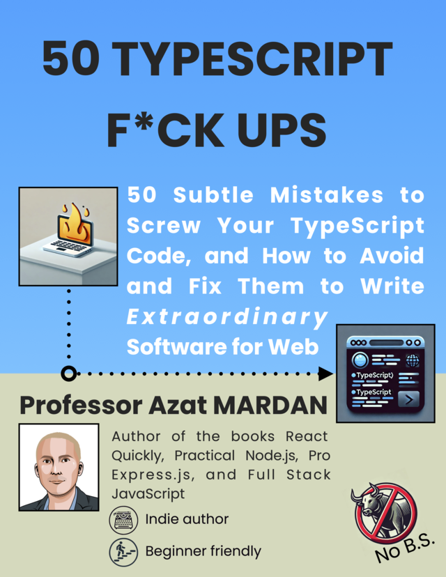

English Repo: https://github.com/azat-co/50-ts

**使用 AI 翻译，仅供参考。**

# 50 TypeScript F*ck Ups 书

## 50 搞砸 TypeScript 代码的细微错误，以及如何避免和修复它们以编写非凡的 Web 软件

本书是作者从多年使用 TypeScript 的经验中提炼出来的。它收集了 TypeScript 开发人员所犯的常见错误以及如何避免这些错误。这本书以轻松愉快的语气编写，旨在快速阅读，尽管它采用美国信函格式超过 250 页。

本书在 Leanpub 上免费分发，您可以在其中下载格式精美的 PDF 和 EPUB 文件，并在本书更新时收到电子邮件更新。

[Download the book on Leanpub for free](https://leanpub.com/50-ts) 或在 GitHub 上阅读此处。

## 目录

* [Welcome](00-welcome.md)

* 1.[Why TypeScript and Why This Book](01-introduction.md)
  * 1.1。为什么选择 TypeScript？
  * 1.2。 TypeScript 是如何工作的？
  * 1.3。本书的结构如何
  * 1.4。如何使用这本书
  * 1.5。这本书的目标读者
  * 1.6。为什么这本书会对你有帮助
  * 1.7。概括

* 2.[Basic TypeScript Mistakes](02-basics.md)
  
* 2.1。经常使用任何
  * 2.2。忽略编译器警告
  * 2.3。不使用严格模式
  * 2.4。错误地声明变量
  * 2.5。滥用可选链
  * 2.6。不使用空合并
  * 2.7。未正确导出/导入
  * 2.8。不使用或滥用类型断言
  * 2.9。不正确地检查相等性
  * 2.10。不理解类型推断
  * 2.11。概括

* 3.[Types, Aliases and Interfaces](03-types.md)

  * 3.1。令人困惑的类型别名和接口
  * 3.2。误解类型加宽
  * 3.3。类型属性的排序不一致
  * 3.4。不必要地扩展接口
  * 3.5。错过使用类型别名的机会
  * 3.6。避免类型保护
  * 3.7。类型过于复杂
    * 3.7.1。嵌套类型
    * 3.7.2。复杂的并集和交集类型
    * 3.7.3。过度使用映射和条件类型
  * 3.8。忽略只读修饰符
  * 3.9。放弃实用程序类型的密钥
  * 3.10。处理对象类型时使用工具类型 Extract 和 Partial
    * 3.10.1。忽略提取以缩小类型
    * 3.10.2。避免将属性标记为可选的 Partial
  * 3.11。概括
* 4.[Functions and Methods](04-functions.md)
  * 4.1。省略返回类型
  * 4.2。函数中类型处理不当
    * 4.2.1。不指定回调函数类型
    * 4.2.2。参数类型不一致
    * 4.2.3。回调缺乏清晰度
  * 4.3。滥用可选函数参数
  * 4.4。休息参数使用不足
    * 4.4.1。将剩余参数与可选参数一起使用
    * 4.4.2。使用正确的类型
    * 4.4.3。使函数签名不必要地复杂化
    * 4.4.4。过度使用休息参数
  * 4.5。不明白这一点
    * 4.5.1。错误地利用 ThisParameterType 来提高 this 上下文的类型安全性
    * 4.5.2。不使用 OmitThisParameter 删除它
  * 4.6。不知道 call、bind、apply 和 strictBindCallApply
  * 4.7。不知道 globalThis
  * 4.8。忽略对象类型中的函数签名
  * 4.9。不正确的函数重载
    * 4.9.1 使用不匹配的重载签名
    * 4.9.2。具有类似的过载
    * 4.9.3。施加过多的过载
  * 4.10。误用函数类型
    * 4.10.1。使用函数类型重载
    * 4.10.2。创建过于复杂的函数类型
    * 4.10.3。混淆函数类型和函数签名
    * 4.10.4。使用过于通用的函数类型
  * 4.11。忽略函数的实用程序类型
    * 4.11.1。忘记 `typeof`
    * 4.11.2。未充分利用 ReturnType 来实现更好的类型推断
    * 4.11.3。放弃参数以获得更清晰的参数类型
  * 4.12。概括
* 5.[Classes and Constructors](05-classes.md)
  * 5.1。了解何时实现类的接口
  * 5.2。滥用抽象类
  * 5.3。滥用静态成员
  * 5.4。错误地应用访问修饰符
  * 5.5。不初始化类属性
  * 5.6。错误地重写方法
  * 5.7。 Getter 和 Setter 不一致
  * 5.8。不知道组合优于类继承
  * 5.9。构造函数中的 Promise 处理不当
  * 5.10。不在类中利用装饰器
  * 5.11。概括
* 6.[Advanced Parts and Bad Parts of TypeScript](06-advanced.md)
  * 6.1。不了解泛型及其约束
  * 6.2。在函数中过度使用泛型
  * 6.3。未能使用通用实用程序类型 Pick 和 Partial
  * 6.4。不理解泛型中的条件类型
  * 6.5。使用枚举代替联合类型
  * 6.6。尽可能不用对象替换元组
  * 6.7。不知道各种类型的缩小技术
  * 6.8。将 `instanceof` 与非类一起使用
  * 6.9。未能使用受歧视的工会
  * 6.10。忽视异步/等待陷阱
    * 6.10.1。没有正确处理承诺
    * 6.10.2。忽略返回的 Promise
    * 6.10.3。错误地处理并发 Promise
  * 6.11。概括
* [Outro](07-outro.md)
